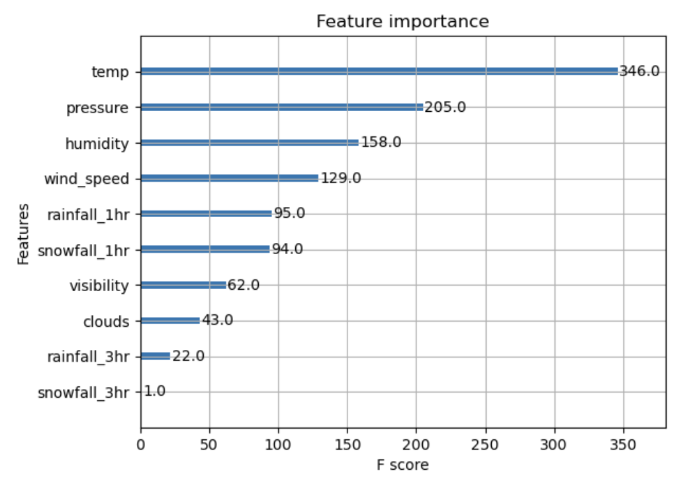
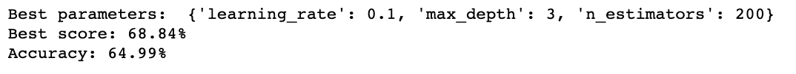

## Milestone 3 - Predict Flight Delays
### Author: Tarin Eccleston

## 1. Goal

Flight delays are sometimes caused by weather conditions that disrupt airport operations and passenger travel plans. This project aims to gather historical flight and weather data to build models to predict if an upcoming flight will be delayed.

## 2. Data Source

I planned to collect flight data from two APIs: FlightAware and FlightRadar24. However, I found the subscription fees for both platforms to be expensive. Instead, I decided to focus on domestic US flights to simplify my problem. This allowed for more consistent and standardized flight data coming from a single country. The US domestic flight network is extensive, providing a large sample size for analysis and the identification of patterns and trends in flight data. This approach also eliminated the need to account for differences in international regulations, weather patterns, and other factors that can affect flight delays and cancellations, making the data exploration process easier.

To collect flight data, I found a useful source on Kaggle with 5.8 million flight records from 2015. While I was not able to access flight data from recent years (2020 onwards), the data was still valuable for my analysis. The source included four datasets with flight, airport, airline, and cancellation reason information. I was able to extract important information about flight delays, including weather-related delays, and departure location and time information for weather data collection.

I used the OpenWeather API to collect weather data, which provided variables such as temperature, wind speed, pressure, rainfall, and humidity. I extracted weather data associated with the origin airport since it was assumed that the primary cause of weather-related flight delays is immediate weather around the departure airport. After preprocessing the flight data, I subset sampled 5000 weather-delayed and 5000 other flights. Using Python, I called the OpenWeather API for each flight in the sample, using the airport coordinates and scheduled flight timestamp to return the associated weather data. Some observations were excluded due to missing data caused by connection issues.

## 3. Data Processing

```{r echo=FALSE, message=FALSE}
setwd("/Users/tarineccleston/Documents/Software-DS/predict-flight-delays/analysis")
library(tidyverse)
library(ggplot2)
library(ggmap)
library(cowplot)
library(maps)

load("../data/intermediate/cleaning/flights_time_cleaned.RData")
airports_df = read.csv("../data/input/airports.csv")
```

Firstly, since we are trying to predict the delay in future flights based on weather data, I removed columns which are not important to building our model and collecting data from the OpenWeather API. Flight delay is the difference between scheduled and actual departure time, usually due to operational or weather issues. Therefore, I dropped time info after departure time, such as taxi time, arrival time, and flight time, and info on whether the flight was diverted.

```{r remove-cols, eval=FALSE, echo=TRUE}
flights_processed_df = flights_processed_df %>%
  select(-c("TAXI_OUT", "WHEELS_OFF", "SCHEDULED_TIME", "ELAPSED_TIME", "AIR_TIME", "DISTANCE", 
            "WHEELS_ON", "TAXI_IN", "SCHEDULED_ARRIVAL", "ARRIVAL_TIME", "ARRIVAL_DELAY", "DIVERTED"))
```

To obtain relevant info for each flight, I joined dataframes on airlines, airports, and cancellation reasons. I used an inner join for airlines and to get carrier names to investigate delay occurrences between carriers. I used IATA codes to get airport info, including coordinates for weather data. I used a left join for cancellation reasons to replace codes with descriptive reasons.

I combined delay times for air system, security, airline, and late aircraft delay and created another column called "OTHER_DELAY" as these delay times are caused by operational issues. I kept the "WEATHER_DELAY" column as is. Combining the columns simplifies the problem for our investigation as we don't need to separate delay types for reasons which aren't related to weather for this study. If flights are delayed for more than 15 minutes for a particular reason, then we can conclude that it was delayed for that reason.

The original dataframe has flight dates where the day, month, and year are separated across columns. I combined these together into a datetime object. I reformatted military text time to be in datetime format for better analysis.

Since the amount of free weather data I could gather from OpenWeather is limited, I created a random subset of 500 non-delayed and 500 delayed flights. Having an equal split allows for less bias when analyzing the difference between weather conditions for non-delayed and delayed flights and when building our predictive model.

## 4. Data Exploration

### 4.1 How comprehensive is our data?

The US has a diverse range of airport locations and weather extremes. Although we have a large data set (5.8 million observations), we aim to understand how comprehensive our data is on domestic flights in the US, in order to better understand trends and limitations when building our predictive model. This map shows the distribution of airports and flight paths throughout the US. Having a diverse range of departure locations is important for capturing a range of weather conditions across the country.

It seems that the data is fairly comprehensive as it covers a large portion of the US and includes a significant number of flights between different airports. However, there are certain regions of the US where flight data appears to be more sparse, such as northern states, Alaska, and the New England region. This limitation in data coverage could affect the accuracy of the model in predicting flight delays for flights departing from those regions. Additionally, bias towards weather in the southern portion of the US could also limit the model's accuracy in predicting flight delays caused by weather conditions in other regions. While the data appears to be comprehensive in general, the limitations in data coverage and bias towards weather in certain regions should be taken into consideration when building the predictive model.

It's also worth noting that the data includes flights to and from island territories such as Hawaii, Puerto Rico, the US Virgin Islands, Guam, and American Samoa. These regions have unique weather patterns compared the mainland US, and can experience tropical storms, hurricanes, and other severe weather conditions, which could impact flight delays.

```{r map, echo=FALSE, message=FALSE, warning=FALSE, fig.align = "center"}
usa = map_data("usa")

airports_df = na.omit(airports_df)

# create a frequency table for flight paths
flight_freq = flights_processed_df %>%
  group_by(ORIGIN_AIRPORT_CODE, DESTINATION_AIRPORT_CODE) %>%
  summarise(FLIGHT_FREQ = n()) %>%
  ungroup()

# merge frequency information with flixghts_processed_df
flights_frequency_df = flights_processed_df %>%
  left_join(flight_freq, by = c("ORIGIN_AIRPORT_CODE", "DESTINATION_AIRPORT_CODE")) %>%
  select(INDEX, ORIGIN_LONGITUDE, ORIGIN_LATITUDE, DESTINATION_LONGITUDE, DESTINATION_LATITUDE, FLIGHT_FREQ)

# Normalize the frequency values to [0, 1] range
flights_frequency_df = flights_frequency_df %>%
  mutate(FREQ_NORM = scales::rescale(FLIGHT_FREQ))

# create plot for each airport
airport_plot = ggplot() + 
  geom_polygon(data = usa, aes(x = long, y = lat, group = group), fill = "white", colour = "black") +
  geom_point(data = airports_df, aes(x = LONGITUDE, y = LATITUDE, color = Airport), size = 0.1, colour = "red") +
  coord_fixed() +
  labs(x = "Longitude", y = "Latitude", title = "Flight Paths across the US in 2015")

flight_plot = airport_plot + 
  geom_segment(data = flights_frequency_df, aes(x = ORIGIN_LONGITUDE, y = ORIGIN_LATITUDE, 
                                     xend = DESTINATION_LONGITUDE, yend = DESTINATION_LATITUDE, 
                                     alpha = FREQ_NORM), 
               color = "blue", linewidth = 0.01) +
  guides(color = "none")

flight_plot
```

It is important to have uniformly distributed data across all days in 2015 in order to capture weather and holiday patterns that might contribute to flight delays. It appears that observations in October uses 5-digit numeric airport codes instead of IATA codes. I couldn't find any references to airports using these codes, so I excluded these observations from my investigation as since we cannot associate the flights with airports between October 2015, and cannot gather the weather data to build our model as a result. One suggested method is to impute these values by searching the flight codes and scheduled departure time and finding the departure airport. However this requires a), a large budget for API calls or b), access to FAA's flight database, neither which I have.

Extreme weather events such as hurricanes, tropical storms, and winter storms can occur during October 2015. It is important to note this as it could affect our data analysis and model by causing some bias. However I believe this shouldn't be a problem as we have plenty of data from adjacent months to capture these extreme weather events.

```{r flight_numbers, echo=FALSE, message=FALSE, warning=FALSE, fig.align = "center", fig.height = 3, fig.width = 7}
flights_processed_df$FLIGHT_DATETIME <- as.Date(flights_processed_df$FLIGHT_DATETIME)

flights_vs_month = ggplot(flights_processed_df, aes(x = FLIGHT_DATETIME)) +
  geom_histogram(binwidth = 1, color = "black", fill = "white") +
  scale_x_date(date_breaks = "1 month", date_labels = "%b %y") +
  labs(x = "Date", y = "Number of flights", title = "Distribution of flights per day in 2015")

flights_vs_month
```

### 4.2 Question 2: Are there any day or time-of-day patterns in flight delays?

```{r delay-times, echo=FALSE, message=FALSE, warning=FALSE, fig.align = "center"}
# date dataframe
flights_delay_by_date_df = flights_processed_df %>%
  group_by(FLIGHT_DATETIME) %>%
  summarize(TOTAL_FLIGHTS = n(), 
            PERCENT_OTHER_DELAY = mean(IS_OTHER_DELAY, na.rm = TRUE) * 100, 
            PERCENT_WEATHER_DELAY = mean(IS_WEATHER_DELAY, na.rm = TRUE) * 100, 
            .groups = 'drop')

flights_delay_by_date_df$FLIGHT_DATETIME <- as.Date(flights_delay_by_date_df$FLIGHT_DATETIME)

# month dataframe
flights_delay_by_month_df = flights_processed_df %>%
  mutate(MONTH = month(SCHEDULED_DEPARTURE_DATETIME)) %>%
  group_by(MONTH) %>%
  summarize(TOTAL_FLIGHTS = n(), 
            PERCENT_OTHER_DELAY = mean(IS_OTHER_DELAY, na.rm = TRUE) * 100, 
            PERCENT_WEATHER_DELAY = mean(IS_WEATHER_DELAY, na.rm = TRUE) * 100, 
            .groups = 'drop')

flights_delay_by_month_df = na.omit(flights_delay_by_month_df) 

# create dummy row for october
new_row = data.frame(MONTH = 10, 
                      TOTAL_FLIGHTS = 0, 
                      PERCENT_OTHER_DELAY = 0, 
                      PERCENT_WEATHER_DELAY = 0)
flights_delay_by_month_df = flights_delay_by_month_df %>%
  add_row(new_row, .after = 9)

# day dataframe
flights_delay_by_day_df = flights_processed_df %>%
  group_by(DAY_OF_WEEK) %>%
  summarize(TOTAL_FLIGHTS = n(), 
            PERCENT_OTHER_DELAY = mean(IS_OTHER_DELAY, na.rm = TRUE) * 100, 
            PERCENT_WEATHER_DELAY = mean(IS_WEATHER_DELAY, na.rm = TRUE) * 100, 
            .groups = 'drop')

# define the order of the days
day_order = c("Monday", "Tuesday", "Wednesday", "Thursday", "Friday", "Saturday", "Sunday")
flights_delay_by_day_df$DAY_OF_WEEK = factor(flights_delay_by_day_df$DAY_OF_WEEK, levels = day_order, ordered = TRUE)

# hour dataframe
flights_delay_by_hour_df = flights_processed_df %>%
  mutate(HOUR = hour(SCHEDULED_DEPARTURE_DATETIME)) %>%
  group_by(HOUR) %>%
  summarize(TOTAL_FLIGHTS = n(), 
            PERCENT_OTHER_DELAY = mean(IS_OTHER_DELAY, na.rm = TRUE) * 100, 
            PERCENT_WEATHER_DELAY = mean(IS_WEATHER_DELAY, na.rm = TRUE) * 100, 
            .groups = 'drop')

flights_delay_by_hour_df = na.omit(flights_delay_by_hour_df) 

# combined plots
flights_delay_by_month = ggplot(flights_delay_by_month_df, aes(x = MONTH)) +
  geom_area(aes(y = PERCENT_OTHER_DELAY, fill = "Other Delay"), alpha = 0.5) +
  geom_area(aes(y = PERCENT_WEATHER_DELAY, fill = "Weather Delay"), alpha = 0.5) +
  geom_smooth(aes(y = PERCENT_OTHER_DELAY, color = "Other Delay"), method = "loess", se = FALSE, span = 0.25) +
  geom_smooth(aes(y = PERCENT_WEATHER_DELAY, color = "Weather Delay"), method = "loess", se = FALSE, span = 0.25) +
  scale_x_continuous(breaks = seq(0, 12, 1)) +
  scale_fill_manual(values = c("grey", "red"), labels = c("Other Delay", "Weather Delay")) +
  scale_color_manual(values = c("black", "black"), labels = c("Other Delay", "Weather Delay")) +
  labs(x = "Months of 2015", y = "Percentage of Delays (%)", fill = "", color = "") +
  ggtitle("Percentage of Other and Weather Delays by Months of 2015")

flights_delay_by_hour = ggplot(flights_delay_by_hour_df, aes(x = HOUR)) +
  geom_area(aes(y = PERCENT_OTHER_DELAY, fill = "Other Delay"), alpha = 0.5) +
  geom_area(aes(y = PERCENT_WEATHER_DELAY, fill = "Weather Delay"), alpha = 0.5) +
  geom_smooth(aes(y = PERCENT_OTHER_DELAY, color = "Other Delay"), method = "loess", se = FALSE, span = 0.25) +
  geom_smooth(aes(y = PERCENT_WEATHER_DELAY, color = "Weather Delay"), method = "loess", se = FALSE, span = 0.25) +
  labs(x = "Hour of Days in 2015", y = "Percentage of Delays (%)", fill = "", color = "") +
  ggtitle("Percentage of Other and Weather Delays by Hour of Days in 2015") +
  scale_x_continuous(breaks = seq(0, 23, 1), labels = paste0(seq(0, 23, 1), ":00")) +
  scale_fill_manual(name = "Delay Type:", values = c("Other Delay" = "grey", "Weather Delay" = "red")) +
  scale_color_manual(name = "Delay Type:", values = c("Other Delay" = "black", "Weather Delay" = "black")) +
  theme(legend.position = "bottom", axis.text.x = element_text(angle = 90, vjust = 0.5, hjust=1))
```

I explored the relationship between time and the flight delays. The first step involves grouping all flights into each respective category. Then, I calculated the percentage of delays caused by other factors or weather for all flights in each of these categories. The plots below show the percentage of other delays and weather delays for each category.

The first plot shows the changes in flight delay percentages throughout 2015. Note that flights in October are excluded from my investigation. There are two peaks in other flight delays: December-February, marking the Christmas holiday period, and June-July, the months when people go on summer vacation. Busy periods can expect issues such as congested runways and airspace, and staff shortage, which would result in operational flight delays. Both plots for weather delays appear to be similar with operational delays. A conclusion we can draw from this is that these two periods have greater extreme weather occurrences. However note that we don't have multiple years of data to accurate confirm that these peaks are indeed seasonal.

```{r delay_times_flights_delay_by_month, echo=FALSE, message=FALSE, warning=FALSE, fig.align = "center", fig.height = 3, fig.width = 7}
flights_delay_by_month
```

It appears that flights later in the day experience a higher chance of getting delayed, as there is a higher likelihood of delays building up due to earlier flight delays and disruptions, such as bad weather, late aircraft arrival, or air traffic congestion. The same trend occurs for weather delay percentages, as it is well-researched that flights later in the day may experience worse weather due to a number of factors. One factor is that thunderstorms and other weather events tend to occur more frequently in the afternoon and evening hours, especially during the summer months. Additionally, as the day progresses, the heat of the sun can cause instability in the atmosphere, leading to the formation of thunderstorms and other types of severe weather.

```{r delay_times_flights_delay_by_hour, echo=FALSE, message=FALSE, warning=FALSE, fig.align = "center", fig.height = 3, fig.width = 7}
flights_delay_by_hour
```

Flights can experience both weather and operational delays. The correlation between operational and weather delay can also be due to late aircraft arrival caused by regional weather disruptions. Although it is useful to understand the relationship between time and the percentage of flight delays due to weather, this could be better explained by weather conditions, which are a function of time of day, and geography, among other factors.

### 4.3 Question 3: Can we distinguish between weather delayed and non-weather delayed flights based on weather data?

```{r weather-data, echo=FALSE, message=FALSE, warning=FALSE}
# load("../data/intermediate/cleaning/flights_weather.RData")
flights_weather_df = read_csv("../data/intermediate/weather_sample_2/weather_data_samples_0-999.csv")

flights_weather_df[is.na(flights_weather_df)] = 0

temp_plot = ggplot(flights_weather_df, aes(x = factor(IS_WEATHER_DELAY), y = temp, fill = factor(IS_WEATHER_DELAY))) +
  geom_violin(width = 0.2, height = 0.2) + 
  ggtitle("Temperature comparison between Weather Delay and Other Flights") +
  labs(x = "", y = "Temperature (C)", fill = "IS_WEATHER_DELAY") +
  scale_fill_manual(values = c("gray", "red"), guide = "none") +
  scale_x_discrete(labels = c("Not Weather Delayed", "Weather Delayed")) +
  theme_classic()

humidity_vs_wind_speed_plot = ggplot(flights_weather_df, aes(x = humidity, y = wind_speed, color = factor(IS_WEATHER_DELAY))) +
  geom_point() +
  scale_color_manual(values = c("black", "red"), 
                     labels = c("Other Delay", "Weather Delayed")) +
  labs(title = "Comparison of Humidity and Wind Speed Between Delay Types",
       x = "Humidity (%)", y = "Wind Speed (m/s)")

ggplot(flights_weather_df, aes(x = wind_speed, y = pressure, color = factor(IS_WEATHER_DELAY))) +
  geom_point() +
  scale_color_manual(values = c("black", "red"), 
                     labels = c("Other Delay", "Weather Delayed")) +
  labs(title = "Comparison of Humidity and Wind Speed Between Delay Types",
       x = "Humidity (%)", y = "Wind Speed (m/s)")

# temp x pressure
# 
```

I would like to compare the differences in physical weather measurements between weather-delayed flights and other flights and infer from there which weather factors are most important. The most interesting plots was that of humidity against wind speed. I found that higher values for both variables increased the likelihood of delayed flights. These two variables could indicate presence of a thunderstorm. Thunderstorms are one of the main causes of flight delays and are more likely to occur when there is a lot of moisture in the air, which can lead to the formation of clouds and thunderstorms. The median humidity are higher for weather-delayed flights compared to other flights. Gale force winds during thunderstorms are also a common cause of flight delays, as they can make takeoff unsafe. The median wind speed appears higher for delayed flights compared to other flights, indicating its significance

```{r weather_data_humidity_vs_wind_speed, echo=FALSE, message=FALSE, warning=FALSE, fig.align = "center", fig.height = 3, fig.width = 7}
humidity_vs_wind_speed_plot
```
\pagebreak
Weather-delayed flights appear to have a multimodal distribution of temperatures with centers at 24C and -2C, compared to other flights which appears uni-modal and skewed to the left with centrality at 24C. The -2C temperature center for weather delayed flights could be capturing the flight events during blizzards and snowstorms. 

```{r weather_data_temp, echo=FALSE, message=FALSE, warning=FALSE, fig.align = "center", fig.height = 3, fig.width = 7}
temp_plot
```

I also gathered categorical data about the weather conditions from OpenWeather. I found that snow conditions appears to have the biggest effect on weather a flight was delayed or not.

```{r weather_data_snow, echo=FALSE, message=FALSE, warning=FALSE, fig.align = "center", fig.height = 3, fig.width = 7}
snow_label_plot
```

## 5. Analytical Plan

The analytical plan will involve continuing to explore trends between weather data and weather-related flight delays, and building models to predict if a flight will be delayed due to weather or not. I initially used a subset sample of 10000 flights with equal balance of weather delayed and other flights for my modelling. I undersampled my non-weather delayed flights class label, and all origin airports have an equal representation in the dataset. Pre-processing techniques such as normalisation was used to ensure the data is of good quality and format before modelling. 

I started with a decision tree model, and evaluated it's performance. I improved on this by using ensemble techniques such as random forests, adaboost, and xgboost. Hyperparameter tuning was conducted using 10-fold cross-validation for each model, and the best model with the optimum hyperparameters were chosen based on the validation accuracies. I explored a reasonable range of hyper parameters such as max tree depth and learning rate, where there is a trade-off on search comprehensiveness and optimization bias. I then used appropriate criteria such as ______ and accuracy to finally compare different model architectures.

Normalisation was also applied to the all the variables independantly between the training and validation splits to insure no information leakage. Normalizing variables ensures that each feature is on a similar scale. This is important because the chosen machine learning architectures can be sensitive to the relative scales of different variables. When variables have vastly different scales, it can lead to biased learning and an undue influence of variables with larger scales on the model training process.

\pagebreak
## 6. Results and Interpretations

### Initial Modelling

For the initial models, I used both the numerical and categorical weather data. Unsurprisingly, I found that the decision tree model performed the worst, with an accuracy of 61%. I then improved this by using Random Forests, which increased test accuracy to 63%. Adaboost didn't produce particularly great results, with an accuracy of 62%, while XGBoost had the highest accuracy of 64.6%. In the end, XGBoost seemed to be the best model for this particular dataset. I repeated the above, but only using categorical weather data. The accuracy for all models dropped. I repeated the same steps but only using numerical weather data and found an accuracy score of 64.6% for XGBoost, which is a similar score to the model with both numerical and categorical weather data. 

I can infer from this that categorical weather data, such as "heavy rain" or "light snow," doesn't provide much more information to the model, as this is already represented in numerical weather data. Additionally, categorical weather data is often quite inconsistent, as I have observed that some observations might indicate rainfall in cm for the hour, while the categorical data would indicate that it was not raining. I decided to drop the categorical weather data.

After some research, I removed the dew point variable from the dataset, as this is redundant since it is mathematically related to temperature and humidity. This resulted in an increase in accuracy to 65%. 

The overall performance of the model is quite poor with an accuracy of 65%, which isn't useful for production. This is only 15% better than guessing at random on our test set. The model is still useful though, as we can use model comparisons and important features to learn more about our data. Namely, categorical weather data is redundant or erroneous, and the most important features to distinguish weather-delayed and other flights seem to be temperature, pressure, humidity, and wind speed.

#### Variable Importance Chart XGBoost Model (Numerical weather variables included, and removal of dew point)

```{r, echo=FALSE, message=FALSE, warning=FALSE, fig.align = "center", fig.height = 3, fig.width = 7} 

```

#### Accuracy of XGBoost Model (Numerical weather variables included, and removal of dew point)

```{r, echo=FALSE, message=FALSE, warning=FALSE, fig.align = "center", fig.height = 3, fig.width = 7} 

```

It is not possible to significantly increase our model accuracy through preprocessing, as the numerical weather data is relatively consistent, reliable, and clean. Gains in model performance can be increased by improving the experimental design. I only collected weather data once for each flight, and that was located exactly at the origin airport. In reality, bad weather along the flight path could also cause weather delays. I plan to collect more weather data along the flight route of each flight and use that in the next XGBoost model. Collecting more weather data per flight using the OpenWeather API would result in greater cost. Instead, I will minimize my observations and only use flight data from certain airports such as Hartsfield–Jackson Atlanta International Airport, Dallas/Fort Worth International Airport, or John F. Kennedy International Airport.

### Multi-modal Modelling

I believe other factors such as geographic location and time ultimately affect the weather conditions of the departure airport for a particular flight. 
- Try resubset flight data using maybe 3 top airports?
- Use some math to calculate locations and timestamps (3 total weather samples)
- Redesign api weather data collection system
- Remodel, maybe with equal weights across all variables. Cut to the chase and go straight to XGBoost / Random Forest
- Look at variable importance and design the affect of geospatial information

### Final Models

I decided to choose ______ in the end as it _____. This gave a test accuracy of ___. I believe ....

## 7. Discussion

### Implications

Once the models have been trained and evaluated, I will select the best performing model and use it to make flight delay predictions. These predictions can be used by airlines to proactively adjust their schedules and minimize the impact of weather-related delays on their operations.

Overall, this analytical plan aims to explore the relationship between weather data and flight delays and to build models that can accurately predict these delays. By doing so, we can help airlines improve their operations and provide a better experience for passengers.

### General Strengths and Weaknesses of Data

Strengths
- LOTS of data from presumably ALL flights
- Able to get relatively comprehensive weather data

Weaknesses
- Missing october data
- 1% of flights are weather delayed
- How the data was labelled - how much can we believe that weather delays were caused completely by weather? High correlation between weather delay time and other delay times
- Do earlier weather delay flights make the current flight "weather delayed" as opposed to "operational delay"?
- 15 minutes+ = Is just a rule of thumb 
- ONLY US data
- incorrect timestamps for openweather api

Other things to note are that small planes are more affected by bad weather compared to larger planes. This will affect the likelihood that the flight is delayed for weather reasons. The simplest way to model this is by adding route length into the model, as this is highly correlated with plane size. Then, we can determine how important it is at predicting weather delays. Lastly, I plan to normalize my numerical data in the next modeling iteration of XGBoost, as it will improve the convergence of the algorithm and prevent it from being dominated by variables with larger magnitudes, such as pressure.

### General Strengths and Weaknesses of Modelling

Strengths
- Relatively simple model architectures
- Only really need to normalise as a preprocessing technique (which needs to ensure not information leakage)
- Don't have distribution assumptions
- Able to make some sort of inference i.e variable important, categorical vs numeric weather data
- Important features

Weaknesses
- Change in model performance if applied to the original data.
- Bias on certain locations/times
- Influence from other factors such as airport location, carrier, aircraft type...
- Didn't factor in taxi out and taxi in which causes errors in timing

\pagebreak
## 7. Appendix

### Data cleaning

```{r data-cleaning-ref, eval=FALSE, echo=TRUE, fig.align = "center"}
setwd("/Users/tarineccleston/Documents/Software-DS/predict-flight-delays")
library(tidyverse)
library(ggplot2)

# read data
flights_df = read.csv("data/flights.csv")
airlines_df = read.csv("data/airlines.csv")
airports_df = read.csv("data/airports.csv")
cancellation_codes_df = read.csv("data/cancellation_codes.csv")

flights_processed_df = data.frame(flights_df)

# remove columns which won't be useful for our prediction
flights_processed_df = flights_processed_df %>%
  select(-c("TAXI_OUT", "WHEELS_OFF", "SCHEDULED_TIME", "ELAPSED_TIME", "AIR_TIME", "DISTANCE", "WHEELS_ON", "TAXI_IN", "SCHEDULED_ARRIVAL", "ARRIVAL_TIME", "ARRIVAL_DELAY", "DIVERTED"))

# join dataframes, use inner join for important information such as airline, departure and arrival airport
# join flights and airline carrier data
colnames(airlines_df) = c("AIRLINE_CODE", "AIRLINE")
colnames(flights_processed_df)[5] = "AIRLINE_CODE"
flights_processed_df = flights_processed_df %>%
  inner_join(airlines_df, by = "AIRLINE_CODE", keep = NULL) %>%
  relocate("AIRLINE", .after = "AIRLINE_CODE")

# combine airline code and flight number together
flights_processed_df$FLIGHT_NUMBER = paste0(flights_processed_df$AIRLINE_CODE, flights_processed_df$FLIGHT_NUMBER)

# replace cancellation reason with cancellation description
flights_processed_df = flights_processed_df %>%
  left_join(cancellation_codes_df, by = "CANCELLATION_REASON", copy = FALSE, keep = NULL) %>%
  relocate("CANCELLATION_DESCRIPTION", .after = "CANCELLATION_REASON") %>%
  select(-CANCELLATION_REASON)

# join flights and airports data to get airport names, city, state and coordinate data for arrival and departure
colnames(flights_processed_df)[9] = "ORIGIN_AIRPORT_CODE"
colnames(flights_processed_df)[10] = "DESTINATION_AIRPORT_CODE"

# for origin airports
colnames(airports_df)[1] = "ORIGIN_AIRPORT_CODE"
flights_processed_df = flights_processed_df %>%
  inner_join(airports_df, by = "ORIGIN_AIRPORT_CODE", copy = FALSE, keep = NULL) %>%
  rename_with(~ paste0("ORIGIN_", .), colnames(airports_df)[2:7]) %>%
  relocate(paste0("ORIGIN_", colnames(airports_df)[2:7]), .after = "ORIGIN_AIRPORT_CODE")
  
# for destination airports
colnames(airports_df)[1] = "DESTINATION_AIRPORT_CODE"
flights_processed_df = flights_processed_df %>%
  inner_join(airports_df, by = "DESTINATION_AIRPORT_CODE", copy = FALSE, keep = NULL) %>%
  rename_with(~ paste0("DESTINATION_", .), colnames(airports_df)[2:7]) %>%
  relocate(paste0("DESTINATION_", colnames(airports_df)[2:7]), .after = "DESTINATION_AIRPORT_CODE")

# if flight is delayed for more than 15 minutes due to weather or any other factors
# we don't need to separate other delay types for this study
# combine other delay times together
flights_processed_df = flights_processed_df %>%
  mutate(IS_OTHER_DELAY = ifelse((AIR_SYSTEM_DELAY >= 15) | (SECURITY_DELAY >= 15) | (AIRLINE_DELAY >= 15) | (LATE_AIRCRAFT_DELAY >= 15), 1, 0)) %>%
  mutate(IS_WEATHER_DELAY = ifelse(WEATHER_DELAY >= 15, 1, 0)) %>%
  mutate(OTHER_DELAY = AIR_SYSTEM_DELAY + SECURITY_DELAY + AIRLINE_DELAY + LATE_AIRCRAFT_DELAY) %>%
  relocate("OTHER_DELAY", .before = "WEATHER_DELAY") %>%
  select(-c("AIR_SYSTEM_DELAY", "SECURITY_DELAY", "AIRLINE_DELAY", "LATE_AIRCRAFT_DELAY"))

# convert n/as for all delay durations to 0
flights_processed_df["OTHER_DELAY"][is.na(flights_processed_df["OTHER_DELAY"])] = 0
flights_processed_df["WEATHER_DELAY"][is.na(flights_processed_df["WEATHER_DELAY"])] = 0
flights_processed_df["IS_OTHER_DELAY"][is.na(flights_processed_df["IS_OTHER_DELAY"])] = 0
flights_processed_df["IS_WEATHER_DELAY"][is.na(flights_processed_df["IS_WEATHER_DELAY"])] = 0

# convert numbers to string days of week
day_names = c("Monday", "Tuesday", "Wednesday", "Thursday", "Friday", "Saturday", "Sunday")
# Map day names to day numbers
flights_processed_df = flights_processed_df %>% 
  mutate(DAY_OF_WEEK = day_names[DAY_OF_WEEK])

convert_time <- function(time) {
  if (is.na(time)) {
    return(NA)
  } else if (time < 10) {
    return(sprintf("00:0%s", time))
  } else if (time < 60) {
    return(sprintf("00:%s", time))
  } else {
    hours <- floor(time / 100)
    minutes <- time %% 100
    return(sprintf("%02d:%02d", hours, minutes))
  }
}

# convert all hour times to HH:MM format
# note: ignore effect of changing timezones and days for now
flights_processed_df = flights_processed_df %>%
  mutate(SCHEDULED_DEPARTURE = sapply(SCHEDULED_DEPARTURE, convert_time)) %>%
  mutate(DEPARTURE_TIME = sapply(DEPARTURE_TIME, convert_time))

flights_processed_df = flights_processed_df %>%
  mutate(FLIGHT_DATETIME = as.POSIXct(paste(YEAR, MONTH, DAY), format = "%Y %m %d")) %>%
  relocate(FLIGHT_DATETIME, .before = "YEAR") %>%
  select(-c("YEAR", "MONTH", "DAY")) %>%
  mutate(SCHEDULED_DEPARTURE_DATETIME = as.POSIXct(paste(FLIGHT_DATETIME, SCHEDULED_DEPARTURE), format = "%Y-%m-%d %H:%M")) %>%
  relocate(SCHEDULED_DEPARTURE_DATETIME, .after = SCHEDULED_DEPARTURE) %>%
  mutate(SCHEDULED_DEPARTURE_DATETIME = as.POSIXct(paste(FLIGHT_DATETIME, SCHEDULED_DEPARTURE), format = "%Y-%m-%d %H:%M")) %>%
  mutate(DEPARTURE_DATETIME = SCHEDULED_DEPARTURE_DATETIME + 60 * DEPARTURE_DELAY) %>%
  relocate(DEPARTURE_DATETIME, .after = DEPARTURE_TIME)

# create index for each flight
flights_processed_df = flights_processed_df %>%
  mutate(INDEX = row.names(flights_processed_df)) %>%
  relocate(INDEX, .before = "FLIGHT_DATETIME")

# separate uncancelled and cancelled flights, not important at the moment but we will separate just in case
flights_cancelled_df = flights_processed_df %>%
  filter(CANCELLED == 1)

flights_processed_df = flights_processed_df %>%
  filter(CANCELLED == 0)

# save whole data for exploratory analysis
save(flights_cancelled_df, file = "output/flights_cancelled.RData")
write.table(flights_cancelled_df, file = "output/flights_cancelled.csv", sep = ",", row.names = FALSE)
save(flights_processed_df, file = "output/flights.RData")
write.table(flights_processed_df, file = "output/flights.csv", sep = ",", row.names = FALSE)

# create n sample subset from our original data
# this will be used for gathering weather data and for building our model
set.seed("991")
n = 1000

# randomly sample 1000 delayed flights
delayed_flights_subset_df = flights_processed_df %>%
  filter(IS_WEATHER_DELAY == TRUE) %>%
  sample_n(n/2)

# randomly sample 1000 on-time flights
on_time_flights_subset_df = flights_processed_df %>%
  filter(IS_WEATHER_DELAY == FALSE) %>%
  sample_n(n/2)

# combine and shuffle data sets
flights_subset_df = rbind(delayed_flights_subset_df, on_time_flights_subset_df)
flights_subset_df <- flights_subset_df[sample(nrow(flights_subset_df)), ]

# save subset data for exploratory analysis
save(flights_subset_df, file = "output/flights_subset.RData")
write.table(flights_subset_df, file = "output/flights_subset.csv", sep = ",", row.names = FALSE)
```

### Visualisation

```{r Q1, eval=FALSE, echo=TRUE}
usa = map_data("usa")

airports_df = na.omit(airports_df)

# create a frequency table for flight paths
flight_freq = flights_processed_df %>%
  group_by(ORIGIN_AIRPORT_CODE, DESTINATION_AIRPORT_CODE) %>%
  summarise(FLIGHT_FREQ = n()) %>%
  ungroup()

# merge frequency information with flixghts_processed_df
flights_frequency_df = flights_processed_df %>%
  left_join(flight_freq, by = c("ORIGIN_AIRPORT_CODE", "DESTINATION_AIRPORT_CODE")) %>%
  select(INDEX, ORIGIN_LONGITUDE, ORIGIN_LATITUDE, DESTINATION_LONGITUDE, DESTINATION_LATITUDE, FLIGHT_FREQ)

# Normalize the frequency values to [0, 1] range
flights_frequency_df = flights_frequency_df %>%
  mutate(FREQ_NORM = scales::rescale(FLIGHT_FREQ))

# create plot for each airport
airport_plot = ggplot() + 
  geom_polygon(data = usa, aes(x = long, y = lat, group = group), fill = "white", colour = "black") +
  geom_point(data = airports_df, aes(x = LONGITUDE, y = LATITUDE, color = Airport), size = 0.1, colour = "red") +
  coord_fixed() +
  labs(x = "Longitude", y = "Latitude", title = "Flight Paths across the US in 2015")

flight_plot = airport_plot + 
  geom_segment(data = flights_frequency_df, aes(x = ORIGIN_LONGITUDE, y = ORIGIN_LATITUDE, 
                                     xend = DESTINATION_LONGITUDE, yend = DESTINATION_LATITUDE, 
                                     alpha = FREQ_NORM), 
               color = "blue", linewidth = 0.01) +
  guides(color = "none")

flight_plot

flights_processed_df$FLIGHT_DATETIME <- as.Date(flights_processed_df$FLIGHT_DATETIME)

ggplot(flights_processed_df, aes(x = FLIGHT_DATETIME)) +
  geom_histogram(binwidth = 1, color = "black", fill = "white") +
  scale_x_date(date_breaks = "1 month", date_labels = "%b %y") +
  labs(x = "Date", y = "Number of flights", title = "Distribution of flights per day in 2015")
```

```{r Q2, eval=FALSE, echo=TRUE}
# date dataframe
flights_delay_by_date_df = flights_processed_df %>%
  group_by(FLIGHT_DATETIME) %>%
  summarize(TOTAL_FLIGHTS = n(), 
            PERCENT_OTHER_DELAY = mean(IS_OTHER_DELAY, na.rm = TRUE) * 100, 
            PERCENT_WEATHER_DELAY = mean(IS_WEATHER_DELAY, na.rm = TRUE) * 100, 
            .groups = 'drop')

flights_delay_by_date_df$FLIGHT_DATETIME <- as.Date(flights_delay_by_date_df$FLIGHT_DATETIME)

# month dataframe
flights_delay_by_month_df = flights_processed_df %>%
  mutate(MONTH = month(SCHEDULED_DEPARTURE_DATETIME)) %>%
  group_by(MONTH) %>%
  summarize(TOTAL_FLIGHTS = n(), 
            PERCENT_OTHER_DELAY = mean(IS_OTHER_DELAY, na.rm = TRUE) * 100, 
            PERCENT_WEATHER_DELAY = mean(IS_WEATHER_DELAY, na.rm = TRUE) * 100, 
            .groups = 'drop')

flights_delay_by_month_df = na.omit(flights_delay_by_month_df) 

# create dummy row for october
new_row = data.frame(MONTH = 10, 
                      TOTAL_FLIGHTS = 0, 
                      PERCENT_OTHER_DELAY = 0, 
                      PERCENT_WEATHER_DELAY = 0)
flights_delay_by_month_df = flights_delay_by_month_df %>%
  add_row(new_row, .after = 9)

# day dataframe
flights_delay_by_day_df = flights_processed_df %>%
  group_by(DAY_OF_WEEK) %>%
  summarize(TOTAL_FLIGHTS = n(), 
            PERCENT_OTHER_DELAY = mean(IS_OTHER_DELAY, na.rm = TRUE) * 100, 
            PERCENT_WEATHER_DELAY = mean(IS_WEATHER_DELAY, na.rm = TRUE) * 100, 
            .groups = 'drop')

# define the order of the days
day_order = c("Monday", "Tuesday", "Wednesday", "Thursday", "Friday", "Saturday", "Sunday")
flights_delay_by_day_df$DAY_OF_WEEK = factor(flights_delay_by_day_df$DAY_OF_WEEK, levels = day_order, ordered = TRUE)

# hour dataframe
flights_delay_by_hour_df = flights_processed_df %>%
  mutate(HOUR = hour(SCHEDULED_DEPARTURE_DATETIME)) %>%
  group_by(HOUR) %>%
  summarize(TOTAL_FLIGHTS = n(), 
            PERCENT_OTHER_DELAY = mean(IS_OTHER_DELAY, na.rm = TRUE) * 100, 
            PERCENT_WEATHER_DELAY = mean(IS_WEATHER_DELAY, na.rm = TRUE) * 100, 
            .groups = 'drop')

flights_delay_by_hour_df = na.omit(flights_delay_by_hour_df) 

# combined plots
ggplot(flights_delay_by_month_df, aes(x = MONTH)) +
  geom_area(aes(y = PERCENT_OTHER_DELAY, fill = "Other Delay"), alpha = 0.5) +
  geom_area(aes(y = PERCENT_WEATHER_DELAY, fill = "Weather Delay"), alpha = 0.5) +
  geom_smooth(aes(y = PERCENT_OTHER_DELAY, color = "Other Delay"), method = "loess", se = FALSE, span = 0.25) +
  geom_smooth(aes(y = PERCENT_WEATHER_DELAY, color = "Weather Delay"), method = "loess", se = FALSE, span = 0.25) +
  scale_x_continuous(breaks = seq(0, 12, 1)) +
  scale_fill_manual(values = c("grey", "red"), labels = c("Other Delay", "Weather Delay")) +
  scale_color_manual(values = c("black", "black"), labels = c("Other Delay", "Weather Delay")) +
  labs(x = "Months of 2015", y = "Percentage of Delays (%)", fill = "", color = "") +
  ggtitle("Percentage of Other and Weather Delays by Months of 2015")

ggplot(flights_delay_by_day_df, aes(x = DAY_OF_WEEK)) +
  geom_bar(aes(y = PERCENT_OTHER_DELAY, fill = "Other Delay"), stat = "identity") +
  geom_bar(aes(y = PERCENT_WEATHER_DELAY, fill = "Weather Delay"), stat = "identity") +
  scale_fill_manual(values = c("Other Delay" = "grey", "Weather Delay" = "red")) +
  labs(x = "Day of Weeks in 2015", y = "Percentage of Delays (%)", fill = "") +
  ggtitle("Percentage of Other and Weather Delays by Day of Weeks in 2015") +
  theme(legend.position = "bottom") +
  geom_text(aes(y = PERCENT_OTHER_DELAY, label = paste0(round(PERCENT_OTHER_DELAY, 1), "%")), vjust = -0.5) +
  geom_text(aes(y = PERCENT_WEATHER_DELAY, label = paste0(round(PERCENT_WEATHER_DELAY, 1), "%")), vjust = -0.5)

ggplot(flights_delay_by_hour_df, aes(x = HOUR)) +
  geom_area(aes(y = PERCENT_OTHER_DELAY, fill = "Other Delay"), alpha = 0.5) +
  geom_area(aes(y = PERCENT_WEATHER_DELAY, fill = "Weather Delay"), alpha = 0.5) +
  geom_smooth(aes(y = PERCENT_OTHER_DELAY, color = "Other Delay"), method = "loess", se = FALSE, span = 0.25) +
  geom_smooth(aes(y = PERCENT_WEATHER_DELAY, color = "Weather Delay"), method = "loess", se = FALSE, span = 0.25) +
  labs(x = "Hour of Days in 2015", y = "Percentage of Delays (%)", fill = "", color = "") +
  ggtitle("Percentage of Other and Weather Delays by Hour of Days in 2015") +
  scale_x_continuous(breaks = seq(0, 23, 1), labels = paste0(seq(0, 23, 1), ":00")) +
  scale_fill_manual(name = "Delay Type:", values = c("Other Delay" = "grey", "Weather Delay" = "red")) +
  scale_color_manual(name = "Delay Type:", values = c("Other Delay" = "black", "Weather Delay" = "black")) +
  theme(legend.position = "bottom", axis.text.x = element_text(angle = 90, vjust = 0.5, hjust=1))
```

```{r Q3, eval=FALSE, echo=TRUE}
load("../data/intermediate/cleaning/flights_weather.RData")

pressure_plot = ggplot(flights_weather_df, aes(x = factor(IS_WEATHER_DELAY), y = pressure, fill = factor(IS_WEATHER_DELAY))) + geom_violin(width = 0.2, height = 0.2) + 
  # ggtitle("Pressure comparison between Weather Delay and Non-Delayed Flights") +
  labs(x = "", y = "Pressure (Millibars)", fill = "IS_WEATHER_DELAY") +
  scale_fill_manual(values = c("gray", "red"), guide = "none") +
  scale_x_discrete(labels = c("Not Weather Delayed", "Weather Delayed")) +
  theme_classic()

humidity_plot = ggplot(flights_weather_df, aes(x = factor(IS_WEATHER_DELAY), y = humidity, fill = factor(IS_WEATHER_DELAY))) + geom_violin(width = 0.2, height = 0.2) + 
  # ggtitle("Humidity comparison between Weather Delay and Non-Delayed Flights") +
  labs(x = "", y = "Humidity (%)", fill = "IS_WEATHER_DELAY") +
  scale_fill_manual(values = c("gray", "red"), guide = "none") +
  scale_x_discrete(labels = c("Not Weather Delayed", "Weather Delayed")) +
  theme_classic()

clouds_plot = ggplot(flights_weather_df, aes(x = factor(IS_WEATHER_DELAY), y = clouds, fill = factor(IS_WEATHER_DELAY))) +
  geom_violin(width = 0.2, height = 0.2) + 
  # ggtitle("Cloud % Cover comparison between Weather Delay and Non-Delayed Flights") +
  labs(x = "", y = "Cloud Percentage Cover (%)", fill = "IS_WEATHER_DELAY") +
  scale_fill_manual(values = c("gray", "red"), guide = "none") +
  scale_x_discrete(labels = c("Not Weather Delayed", "Weather Delayed")) +
  theme_classic()

wind_speed_plot = ggplot(flights_weather_df, aes(x = factor(IS_WEATHER_DELAY), y = wind_speed, fill = factor(IS_WEATHER_DELAY))) +
  geom_violin(width = 0.2, height = 0.2) + 
  # ggtitle("Wind Speed comparison between Weather Delay and Non-Delayed Flights") +
  labs(x = "", y = "Wind Speed (m/s)") +
  scale_fill_manual(values = c("gray", "red"), guide = "none") +
  scale_x_discrete(labels = c("Not Weather Delayed", "Weather Delayed")) +
  theme_classic()

rainfall_1hr = ggplot(flights_weather_df, aes(x = factor(IS_WEATHER_DELAY), y = snowfall_1hr, fill = factor(IS_WEATHER_DELAY))) +
  geom_violin(width = 0.2, height = 0.2) + 
  # ggtitle("Wind Speed comparison between Weather Delay and Non-Delayed Flights") +
  labs(x = "", y = "Wind Speed (m/s)") +
  scale_fill_manual(values = c("gray", "red"), guide = "none") +
  scale_x_discrete(labels = c("Not Weather Delayed", "Weather Delayed")) +
  theme_classic()

# categorical weather plots

thunderstorm_label_plot = ggplot(flights_weather_df, aes(x = thunderstorm, y = IS_WEATHER_DELAY, color = thunderstorm)) +
  geom_jitter(width = 0.2, height = 0.1) +
  labs(x = "Types of Thunderstorm", y = "Weather Delayed", title = "Thunderstorm vs Weather Delay")

rain_label_plot = ggplot(flights_weather_df, aes(x = rain, y = IS_WEATHER_DELAY, color = rain)) +
  geom_jitter(width = 0.2, height = 0.1) +
  labs(x = "Types of Rain", y = "Weather Delayed", title = "Rain vs Weather Delay")

drizzle_label_plot = ggplot(flights_weather_df, aes(x = drizzle, y = IS_WEATHER_DELAY, color = drizzle)) +
  geom_jitter(width = 0.2, height = 0.1, size = 3, alpha = 0.5) +
  labs(x = "Types of Drizzle", y = "Weather Delayed", title = "Drizzle vs Weather Delay")

snow_label_plot = ggplot(flights_weather_df, aes(x = snow, y = IS_WEATHER_DELAY, color = snow)) +
  geom_jitter(width = 0.2, height = 0.1, size = 3, alpha = 0.5) +
  labs(x = "Types of Snow", y = "Weather Delayed", title = "Snow vs Weather Delay")

fog_label_plot = ggplot(flights_weather_df, aes(x = fog, y = IS_WEATHER_DELAY, color = fog)) +
  geom_jitter(width = 0.2, height = 0.1, size = 3, alpha = 0.5) +
  labs(x = "Types of Fog", y = "Weather Delayed", title = "Fog vs Weather Delay")
```

### Python Code to Extract Weather Data

```{r mining, eval=FALSE, echo=TRUE}
### main.py

from weather_miner import WeatherMiner
import pandas as pd
from dotenv import load_dotenv
import os

load_dotenv()

def main():
    api_username = os.getenv('API_USERNAME')
    api_key = os.getenv('API_KEY')
    weather_miner = WeatherMiner(api_username, api_key)
    


    flights_df = pd.read_csv('output/flights_subset.csv')
    weather_data = pd.DataFrame()

    # get timestamp for scheduled departure time
    flights_df['SCHEDULED_DEPARTURE_DATETIME'] = pd.to_datetime(flights_df['SCHEDULED_DEPARTURE_DATETIME'], format='%Y-%m-%d %H:%M')
    flights_df['SCHEDULED_DEPARTURE_TIMESTAMP'] = flights_df['SCHEDULED_DEPARTURE_DATETIME'].apply(lambda x: x.timestamp()).round(0).astype(int)
    
    # gather weather data as rows and continuously append
    for i in range(0,len(flights_df)):
        airport_code = flights_df.loc[i,'ORIGIN_AIRPORT_CODE']
        timestamp = flights_df.loc[i,'SCHEDULED_DEPARTURE_TIMESTAMP']

        weather_event = weather_miner.get_weather_event(airport_code, timestamp)

        weather_event = pd.DataFrame([weather_event])
        weather_event.insert(0, 'INDEX', flights_df.loc[i, 'INDEX'])
        print(i)
        print(weather_event)
        weather_data = pd.concat([weather_data, weather_event], ignore_index=True)

    weather_data.to_csv('output/weather_data.csv', index=False)

if __name__ == "__main__": {
    main()
}

### weather_miner.py

import requests
import datetime
import random
import json

import airportsdata

class WeatherMiner:
    def __init__(self, username, api_key):
        self.username = username
        self.api_key = api_key
        self.units = "metric"
        
    def get_weather_event(self, airport_code, timestamp):
        # get airport data
        airports = airportsdata.load('IATA')  # use IATA identifier
        airport = airports[airport_code]

        response = requests.get(f"https://api.openweathermap.org/data/3.0/onecall/timemachine?lat={airport['lat']}&lon={airport['lon']}&dt={timestamp}&appid={self.api_key}&units={self.units}")
        if response.status_code == 200:
            weather_event = response.json()

            # gather only the weather data component of the dictionary
            # weather_row = weather_row['data'][0]

            weather_event = {
                "temp": weather_event["data"][0].get("temp"),
                "pressure": weather_event["data"][0].get("pressure"),
                "humidity": weather_event["data"][0].get("humidity"),
                "dew_point": weather_event["data"][0].get("dew_point"),
                "clouds": weather_event["data"][0].get("clouds"),
                "visibility": weather_event["data"][0].get("visibility"),
                "wind_speed": weather_event["data"][0].get("wind_speed"),
                "rainfall_1hr": weather_event["data"][0].get("rain", {}).get("1h"),
            }

            return weather_event
        else:
            print("Error: Could not retrieve weather data")
            return {}
```
