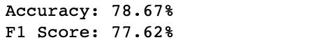
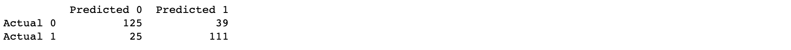
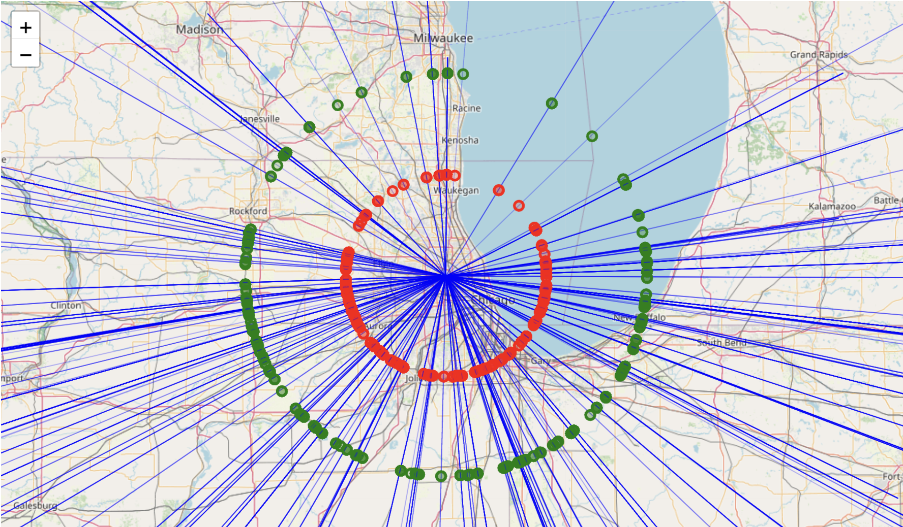

## Milestone 4 - Predict Flight Delays
### Author: Tarin Eccleston

## 1. Goal

Flight delays are sometimes caused by weather conditions that disrupt airport operations and passenger travel plans. This project aims to gather historical flight and weather data to build models to predict if an upcoming flight will be delayed.

## 2. Data Source

I initially planned to collect flight data from two APIs: FlightAware and FlightRadar24. However, I found the subscription fees to be expensive for both platforms. Instead, I decided to focus on domestic US flights to simplify my problem. This allowed for more consistent and standardized flight data coming from a single country. The US domestic flight network is extensive, providing a large sample size for analysis and the identification of patterns and trends in flight data. This approach also eliminated the need to account for differences in international regulations, weather patterns, and other factors that can affect flight delays and cancellations, making the data exploration process easier.

To collect flight data, I found a useful source on Kaggle with 5.8 million domestic flight records from 2015 in the US. While I was not able to access flight data from recent years (2020 onwards), the data was still valuable for my analysis. The source included four datasets with flight, airport, airline, and cancellation reason information. I was able to extract important information about flight delays, including weather-related delays, and departure location and time information for weather data collection.

I used the OpenWeather API to collect weather data in Python. This provided variables such as temperature, wind speed, pressure, rainfall, and humidity at a given time and coordinates. I initially collected weather data associated with the origin airport since it was assumed that the primary cause of weather-related flight delays is immediate weather around the departure airport, however I later collected additional weather data along the flight path. After preprocessing the flight data, I subset sampled 500 weather-delayed and 500 other flights from Chicago O'Hare airport. Some observations were excluded due to missing data caused by connection issues.

## 3. Data Processing

```{r echo=FALSE, message=FALSE}
setwd("/Users/tarineccleston/Documents/Software-DS/predict-flight-delays/analysis")
library(tidyverse)
library(ggplot2)
library(ggmap)
library(cowplot)
library(maps)

load("../data/intermediate/cleaning/flights_time_cleaned_analysis.RData")
airports_df = read.csv("../data/input/airports.csv")
```

Firstly, since we are trying to predict the delay in future flights based on weather data, I removed columns which are not important to building our model and collecting data from the OpenWeather API. Flight delay is the difference between scheduled and actual departure time, usually due to operational or weather issues. I dropped time info after departure time, such as taxi time, arrival time, and info on whether the flight was diverted. Scheduled time and distance were useful when used to calculate the timestamps and coordinates for collecting weather data along the flight path.

```{r remove-cols, eval=FALSE, echo=TRUE}
flights_processed_df = flights_processed_df %>%
  select(-c("TAXI_OUT", "WHEELS_OFF", "ELAPSED_TIME", "AIR_TIME", 
            "WHEELS_ON", "TAXI_IN", "ARRIVAL_TIME", "ARRIVAL_DELAY", "DIVERTED"))
```

To obtain relevant info for each flight, I joined dataframes on airlines, and airports. I used an inner join for airlines and to get carrier names to investigate delay occurrences between carriers. I used IATA codes to get airport info, including coordinates for weather data.

I combined delay times for air system, security, airline, and late aircraft delay and created another column called "OTHER_DELAY" as these delay times are caused by operational issues. I kept the "WEATHER_DELAY" column as is. Combining the columns simplifies the problem for our investigation as we don't need to separate delay types for reasons which aren't related to weather for this study. If flights are delayed for more than 15 minutes for a particular reason, then we can conclude that it was delayed for that reason.

The original dataframe has flight dates where the day, month, and year are separated across columns. I combined these together into a datetime object. I reformatted military text time to be in datetime format for better analysis, and made an amalgamation of date and time. As I later found out, the OpenWeather API takes the UNIX timestamp as an input, since the flight times given were in local time, I added timezone information into the datetime objects.

Since the amount of free weather data I could gather from OpenWeather API is limited, I created a random subset of 500 non-delayed and 500 delayed flights from O'Hare Chicago Airport and used this flight information in conjunction to the associate weather data to build a model. Having an equal split reduces bias when analysing the difference between weather conditions for non-delayed and delayed flights and when building our predictive model.

I use the geosphere package and calculated the flight bearing, scheduled average meters per minute of the flight, used these to calculate the coordinates and scheduled timestamp at 50km and 100km along the flight path. I found the mean of each collected weather variable between the origin, 50km and 100km points, this reduced the number of dimensions and was a method of dealing with missing values without introducing bias into the data.

```{r geosphere, eval=FALSE, echo=TRUE}
for (i in 1:1000) {
  flights_subset_df$LATITUDE_50KM[i] = destPoint(c(flights_subset_df$ORIGIN_LONGITUDE[i], flights_subset_df$ORIGIN_LATITUDE[i]), flights_subset_df$FLIGHT_BEARING[i], 50 * 1000)[2]
  flights_subset_df$LONGITUDE_50KM[i] = destPoint(c(flights_subset_df$ORIGIN_LONGITUDE[i], flights_subset_df$ORIGIN_LATITUDE[i]), flights_subset_df$FLIGHT_BEARING[i], 50 * 1000)[1]
  flights_subset_df$LATITUDE_100KM[i] = destPoint(c(flights_subset_df$ORIGIN_LONGITUDE[i], flights_subset_df$ORIGIN_LATITUDE[i]), flights_subset_df$FLIGHT_BEARING[i], 100 * 1000)[2]
  flights_subset_df$LONGITUDE_100KM[i] = destPoint(c(flights_subset_df$ORIGIN_LONGITUDE[i], flights_subset_df$ORIGIN_LATITUDE[i]), flights_subset_df$FLIGHT_BEARING[i], 100 * 1000)[1]
}
```

## 4. Data Exploration

### 4.1 How comprehensive is our data?

The US has a diverse range of airport locations and weather extremes. Although we have a large data set (5.8 million observations), we aim to understand how comprehensive our data is on domestic flights in the US, in order to better understand trends and limitations when building our predictive model. This map shows the distribution of airports and flight paths throughout the US. Having a diverse range of departure locations is important for capturing a range of weather conditions across the country.

It seems that the data is fairly comprehensive as it covers a large portion of the US and includes a significant number of flights between different airports. However, there are certain regions of the US where flight data appears to be more sparse, such as northern states, Alaska, and the New England region. This limitation in data coverage could affect the accuracy of the model in predicting flight delays for flights departing from those regions. Additionally, bias towards weather in the southern portion of the US could also limit the model's accuracy in predicting flight delays caused by weather conditions in other regions. While the data appears to be comprehensive in general, the limitations in data coverage and bias towards weather in certain regions should be taken into consideration when building the predictive model.

It's also worth noting that the data includes flights to and from island territories such as Hawaii, Puerto Rico, the US Virgin Islands, Guam, and American Samoa. These regions have unique weather patterns compared the mainland US, and can experience tropical storms, hurricanes, and other severe weather conditions, which could impact flight delays.

```{r map, echo=FALSE, message=FALSE, warning=FALSE, fig.align = "center"}
usa = map_data("usa")

airports_df = na.omit(airports_df)

# create a frequency table for flight paths
flight_freq = flights_processed_df %>%
  group_by(ORIGIN_AIRPORT_CODE, DESTINATION_AIRPORT_CODE) %>%
  summarise(FLIGHT_FREQ = n()) %>%
  ungroup()

# merge frequency information with flixghts_processed_df
flights_frequency_df = flights_processed_df %>%
  left_join(flight_freq, by = c("ORIGIN_AIRPORT_CODE", "DESTINATION_AIRPORT_CODE")) %>%
  select(INDEX, ORIGIN_LONGITUDE, ORIGIN_LATITUDE, DESTINATION_LONGITUDE, DESTINATION_LATITUDE, FLIGHT_FREQ)

# Normalize the frequency values to [0, 1] range
flights_frequency_df = flights_frequency_df %>%
  mutate(FREQ_NORM = scales::rescale(FLIGHT_FREQ))

# create plot for each airport
airport_plot = ggplot() + 
  geom_polygon(data = usa, aes(x = long, y = lat, group = group), fill = "white", colour = "black") +
  geom_point(data = airports_df, aes(x = LONGITUDE, y = LATITUDE, color = Airport), size = 0.1, colour = "red") +
  coord_fixed() +
  labs(x = "Longitude", y = "Latitude", title = "Flight Paths across the US in 2015")

flight_plot = airport_plot + 
  geom_segment(data = flights_frequency_df, aes(x = ORIGIN_LONGITUDE, y = ORIGIN_LATITUDE, 
                                     xend = DESTINATION_LONGITUDE, yend = DESTINATION_LATITUDE, 
                                     alpha = FREQ_NORM), 
               color = "blue", linewidth = 0.01) +
  guides(color = "none")

flight_plot
```

It is important to have uniformly distributed data across all days in 2015 in order to capture weather and holiday patterns that might contribute to flight delays. It appears that observations in October uses 5-digit numeric airport codes instead of IATA codes. I couldn't find any references to airports using these codes, so I excluded these observations from my investigation as since we cannot associate the flights with airports between October 2015, and cannot gather the weather data to build our model as a result. One suggested method is to impute these values by searching the flight codes and scheduled departure time and finding the departure airport. However this requires a), a large budget for API calls or b), access to FAA's flight database, neither which I have.

Extreme weather events such as hurricanes, tropical storms, and winter storms can occur during October 2015. It is important to note this as it could affect our data analysis and model by causing some bias. However I believe this shouldn't be a problem as we have plenty of data from adjacent months to capture these extreme weather events.

```{r flight_numbers, echo=FALSE, message=FALSE, warning=FALSE, fig.align = "center", fig.height = 3, fig.width = 7}
flights_processed_df$FLIGHT_DATETIME <- as.Date(flights_processed_df$FLIGHT_DATETIME)

flights_vs_month = ggplot(flights_processed_df, aes(x = FLIGHT_DATETIME)) +
  geom_histogram(binwidth = 1, color = "black", fill = "white") +
  scale_x_date(date_breaks = "1 month", date_labels = "%b %y") +
  labs(x = "Date", y = "Number of flights", title = "Distribution of flights per day in 2015")

flights_vs_month
```

### 4.2 Question 2: Are there any day or time-of-day patterns in flight delays?

```{r delay-times, echo=FALSE, message=FALSE, warning=FALSE, fig.align = "center"}
# date dataframe
flights_delay_by_date_df = flights_processed_df %>%
  group_by(FLIGHT_DATETIME) %>%
  summarize(TOTAL_FLIGHTS = n(), 
            PERCENT_OTHER_DELAY = mean(IS_OTHER_DELAY, na.rm = TRUE) * 100, 
            PERCENT_WEATHER_DELAY = mean(IS_WEATHER_DELAY, na.rm = TRUE) * 100, 
            .groups = 'drop')

flights_delay_by_date_df$FLIGHT_DATETIME <- as.Date(flights_delay_by_date_df$FLIGHT_DATETIME)

# month dataframe
flights_delay_by_month_df = flights_processed_df %>%
  mutate(MONTH = month(SCHEDULED_DEPARTURE_DATETIME)) %>%
  group_by(MONTH) %>%
  summarize(TOTAL_FLIGHTS = n(), 
            PERCENT_OTHER_DELAY = mean(IS_OTHER_DELAY, na.rm = TRUE) * 100, 
            PERCENT_WEATHER_DELAY = mean(IS_WEATHER_DELAY, na.rm = TRUE) * 100, 
            .groups = 'drop')

flights_delay_by_month_df = na.omit(flights_delay_by_month_df) 

# create dummy row for october
new_row = data.frame(MONTH = 10, 
                      TOTAL_FLIGHTS = 0, 
                      PERCENT_OTHER_DELAY = 0, 
                      PERCENT_WEATHER_DELAY = 0)
flights_delay_by_month_df = flights_delay_by_month_df %>%
  add_row(new_row, .after = 9)

# day dataframe
flights_delay_by_day_df = flights_processed_df %>%
  group_by(DAY_OF_WEEK) %>%
  summarize(TOTAL_FLIGHTS = n(), 
            PERCENT_OTHER_DELAY = mean(IS_OTHER_DELAY, na.rm = TRUE) * 100, 
            PERCENT_WEATHER_DELAY = mean(IS_WEATHER_DELAY, na.rm = TRUE) * 100, 
            .groups = 'drop')

# define the order of the days
day_order = c("Monday", "Tuesday", "Wednesday", "Thursday", "Friday", "Saturday", "Sunday")
flights_delay_by_day_df$DAY_OF_WEEK = factor(flights_delay_by_day_df$DAY_OF_WEEK, levels = day_order, ordered = TRUE)

# hour dataframe
flights_delay_by_hour_df = flights_processed_df %>%
  mutate(HOUR = hour(SCHEDULED_DEPARTURE_DATETIME)) %>%
  group_by(HOUR) %>%
  summarize(TOTAL_FLIGHTS = n(), 
            PERCENT_OTHER_DELAY = mean(IS_OTHER_DELAY, na.rm = TRUE) * 100, 
            PERCENT_WEATHER_DELAY = mean(IS_WEATHER_DELAY, na.rm = TRUE) * 100, 
            .groups = 'drop')

flights_delay_by_hour_df = na.omit(flights_delay_by_hour_df) 

# combined plots
flights_delay_by_month = ggplot(flights_delay_by_month_df, aes(x = MONTH)) +
  geom_area(aes(y = PERCENT_OTHER_DELAY, fill = "Other Delay"), alpha = 0.5) +
  geom_area(aes(y = PERCENT_WEATHER_DELAY, fill = "Weather Delay"), alpha = 0.5) +
  geom_smooth(aes(y = PERCENT_OTHER_DELAY, color = "Other Delay"), method = "loess", se = FALSE, span = 0.25) +
  geom_smooth(aes(y = PERCENT_WEATHER_DELAY, color = "Weather Delay"), method = "loess", se = FALSE, span = 0.25) +
  scale_x_continuous(breaks = seq(0, 12, 1)) +
  scale_fill_manual(values = c("grey", "red"), labels = c("Other Delay", "Weather Delay")) +
  scale_color_manual(values = c("black", "black"), labels = c("Other Delay", "Weather Delay")) +
  labs(x = "Months of 2015", y = "Percentage of Delays (%)", fill = "", color = "") +
  ggtitle("Percentage of Other and Weather Delays by Months of 2015")

flights_delay_by_hour = ggplot(flights_delay_by_hour_df, aes(x = HOUR)) +
  geom_area(aes(y = PERCENT_OTHER_DELAY, fill = "Other Delay"), alpha = 0.5) +
  geom_area(aes(y = PERCENT_WEATHER_DELAY, fill = "Weather Delay"), alpha = 0.5) +
  geom_smooth(aes(y = PERCENT_OTHER_DELAY, color = "Other Delay"), method = "loess", se = FALSE, span = 0.25) +
  geom_smooth(aes(y = PERCENT_WEATHER_DELAY, color = "Weather Delay"), method = "loess", se = FALSE, span = 0.25) +
  labs(x = "Hour of Days in 2015", y = "Percentage of Delays (%)", fill = "", color = "") +
  ggtitle("Percentage of Other and Weather Delays by Hour of Days in 2015") +
  scale_x_continuous(breaks = seq(0, 23, 1), labels = paste0(seq(0, 23, 1), ":00")) +
  scale_fill_manual(name = "Delay Type:", values = c("Other Delay" = "grey", "Weather Delay" = "red")) +
  scale_color_manual(name = "Delay Type:", values = c("Other Delay" = "black", "Weather Delay" = "black")) +
  theme(legend.position = "bottom", axis.text.x = element_text(angle = 90, vjust = 0.5, hjust=1))
```

I explored the relationship between time and the flight delays. The first step involves grouping all flights into each respective category. Then, I calculated the percentage of delays caused by other factors or weather for all flights in each of these categories. The plots below show the percentage of other delays and weather delays for each category.

The first plot shows the changes in flight delay percentages throughout 2015. Note that flights in October are excluded from my investigation. There are two peaks in other flight delays: December-February, marking the Christmas holiday period, and June-July, the months when people go on summer vacation. Busy periods can expect issues such as congested runways and airspace, and staff shortage, which would result in operational flight delays. Both plots for weather delays appear to be similar with operational delays. A conclusion we can draw from this is that these two periods have greater extreme weather occurrences. However note that we don't have multiple years of data to accurate confirm that these peaks are indeed seasonal.

```{r delay_times_flights_delay_by_month, echo=FALSE, message=FALSE, warning=FALSE, fig.align = "center", fig.height = 3, fig.width = 7}
flights_delay_by_month
```

It appears that flights later in the day experience a higher chance of getting delayed, as there is a higher likelihood of delays building up due to earlier flight delays and disruptions, such as bad weather, late aircraft arrival, or air traffic congestion. The same trend occurs for weather delay percentages, as it is well-researched that flights later in the day may experience worse weather due to a number of factors. One factor is that thunderstorms and other weather events tend to occur more frequently in the afternoon and evening hours, especially during the summer months. Additionally, as the day progresses, the heat of the sun can cause instability in the atmosphere, leading to the formation of thunderstorms and other types of severe weather.

```{r delay_times_flights_delay_by_hour, echo=FALSE, message=FALSE, warning=FALSE, fig.align = "center", fig.height = 3, fig.width = 7}
flights_delay_by_hour
```

Flights can experience both weather and operational delays. The correlation between operational and weather delay can also be due to late aircraft arrival caused by regional weather disruptions. Although it is useful to understand the relationship between time and the percentage of flight delays due to weather, this could be better explained by weather conditions, which are a function of time of day, and geography, among other factors.

### 4.3 Question 3: Can we distinguish between weather delayed and other flights based on weather data?

```{r weather-data, echo=FALSE, message=FALSE, warning=FALSE}
flights_weather_df = read_csv("../data/intermediate/modelling/flights_weather_modelling.csv")

flights_weather_df[is.na(flights_weather_df)] = 0

temp_plot = ggplot(flights_weather_df, aes(x = factor(IS_WEATHER_DELAY), y = temp, fill = factor(IS_WEATHER_DELAY))) +
  geom_violin(width = 0.2, height = 0.2) + 
  ggtitle("Temperature comparison between Weather Delay and Other Flights") +
  labs(x = "", y = "Temperature (C)", fill = "IS_WEATHER_DELAY") +
  scale_fill_manual(values = c("gray", "red"), guide = "none") +
  scale_x_discrete(labels = c("Other Flights", "Weather Delayed Flights")) +
  theme_classic()

humidity_plot = ggplot(flights_weather_df, aes(x = factor(IS_WEATHER_DELAY), y = humidity, fill = factor(IS_WEATHER_DELAY))) +
  geom_violin(width = 0.2, height = 0.2) + 
  ggtitle("Humidity comparison between Weather Delay and Other Flights") +
  labs(x = "", y = "Humidity (%)", fill = "IS_WEATHER_DELAY") +
  scale_fill_manual(values = c("gray", "red"), guide = "none") +
  scale_x_discrete(labels = c("Other Flights", "Weather Delayed Flights")) +
  theme_classic()

pressure_plot = ggplot(flights_weather_df, aes(x = factor(IS_WEATHER_DELAY), y = pressure, fill = factor(IS_WEATHER_DELAY))) +
  geom_violin(width = 0.2, height = 0.2) + 
  ggtitle("Pressure comparison between Weather Delay and Other Flights") +
  labs(x = "", y = "Pressure (mbars)", fill = "IS_WEATHER_DELAY") +
  scale_fill_manual(values = c("gray", "red"), guide = "none") +
  scale_x_discrete(labels = c("Other Flights", "Weather Delayed Flights")) +
  theme_classic()

temp_vs_snowfall_plot = ggplot(flights_weather_df, aes(x = temp, y = snowfall_1hr, color = factor(IS_WEATHER_DELAY))) +
  geom_point() +
  scale_color_manual(values = c("black", "red"), 
                     labels = c("Other Flights", "Weather Delayed Flights")) +
  labs(title = "Comparison of Temperature and Snowfall between Weather Delay and Other Flights",
       x = "Temperature (C)", y = "Snowfall (cm/hr)")

temp_vs_rainfall_plot = ggplot(flights_weather_df, aes(x = humidity, y = rainfall_1hr, color = factor(IS_WEATHER_DELAY))) +
  geom_point() +
  scale_color_manual(values = c("black", "red"), 
                     labels = c("Other Flights", "Weather Delayed Flights")) +
  labs(title = "Comparison of Temperature and Rainfall between Weather Delay and Other Flights",
       x = "Temperature (C)", y = "Rainfall (cm/hr)")

temp_vs_wind_speed_plot = ggplot(flights_weather_df, aes(x = humidity, y = wind_speed, color = factor(IS_WEATHER_DELAY))) +
  geom_point() +
  scale_color_manual(values = c("black", "red"), 
                     labels = c("Other Flights", "Weather Delayed Flights")) +
  labs(title = "Comparison of Temperature and Rainfall between Weather Delay and Other Flights",
       x = "Temperature (C)", y = "Rainfall (cm/hr)")
```

I would like to compare the differences in physical weather measurements between weather-delayed flights and other flights and infer from there which weather factors are most important. The violin plots for temperature, humidity and pressure between weather delayed and other flights show that these weather variables are probably the most significant predictors.

Weather delayed flights appear to have a multi-modal distribution of temperatures with centers at 24C and -2C, compared to other flights which appears uni-modal and skewed to the left with centrality at 24C. The -2C temperature center for weather delayed flights could be capturing the flight events during blizzards and snowstorms. 

```{r weather_data_temp, echo=FALSE, message=FALSE, warning=FALSE, fig.align = "center", fig.height = 2.5, fig.width = 6}
temp_plot
```

Looking at the humidity comparison, weather delayed flights appear to be scheduled during higher humidity compared to other flights. Other flights appear to have a cnetral distribution about 70% humidity, whereas weather delayed flights have a left-skewed distribution, with a median around 90% humidity.

```{r weather_data_humidity, echo=FALSE, message=FALSE, warning=FALSE, fig.align = "center", fig.height = 2.5, fig.width = 6}
humidity_plot
```

Low pressure systems typically lead to bad weather conditions due to the associated air movement and atmospheric instability. In areas of low pressure, air tends to rise, leading to the formation of clouds, precipitation, and potentially severe weather phenomena such as storms or hurricanes. Flights which aren't delayed have a clear median of 1013 mbar, with a light right-skew. Interestingly, weather delayed flights have a multi-modal pressure distribution with centers at 1005 mbar and 1025 mbar. The weather delayed flights with higher pressure could be delayed due to other variables which aren't directly related to pressure.

```{r weather_data_pressure, echo=FALSE, message=FALSE, warning=FALSE, fig.align = "center", fig.height = 2.5, fig.width = 6}
pressure_plot
```

The most interesting plot is the temperature vs pressure plot, which approximately shows a negative relationship between the two variables. Lower temperatures result in higher pressure, this could explain the source of the delayed flights which have a have higher pressure. Lower temperatures are typically unfavorable for take-offs as it can cause frost/ice buildup on the aircraft and runway. The area marked in green shows the range of temperatures and pressure striking an ideal balance for conditions for take off.  

```{r weather_data_temperature_vs_pressure, echo=FALSE, message=FALSE, warning=FALSE, fig.align = "center", fig.height = 2.5, fig.width = 6}
temp_vs_pressure_plot = ggplot(flights_weather_df, aes(x = temp, y = pressure, color = factor(IS_WEATHER_DELAY))) +
  annotate('rect', xmin = 3, xmax = 18, ymin = 980, ymax = 1050, alpha = 0.4, fill = 'green') +
  geom_point() +
  scale_color_manual(values = c("black", "red"), 
                     labels = c("Other Flights", "Weather Delayed Flights")) +
  stat_smooth(method = "lm", col = "blue") +
  labs(title = "Comparison of Temperature and Pressure between Weather Delay and Other Flights",
       x = "Temperature (C)", y = "Pressure (Pa)")

temp_vs_pressure_plot
```

## 5. Analytical Plan

The analytical plan will involve continuing to explore relationships in weather and flight data, and building models to predict if a flight will be delayed due to weather or not. I initially used a subset sample of 1000 flights leaving from O'Harte Chicago Airport with equal balance of weather delayed and other flights for my modelling. Pre-processing techniques such as normalisation and averaging was used to ensure the data is of good quality and format before modelling. 

I started with a decision tree model, and evaluated it's performance. I improved on this by using ensemble techniques such as random forests, adaboost, and XGboost. Hyperparameter tuning was conducted using 10-fold cross-validation for each model, and the best model with the optimum hyperparameters were chosen based on the validation accuracies. I explored a reasonable range of hyper parameters such as max tree depth and learning rate, where there is a trade-off on search comprehensiveness and optimization bias. I then used appropriate criteria metrics such as the confusion matrix, accuracy and F1 score to finally compare different model architectures. I believe the F1 score is a good measure of overall performance of a model as it is the harmonic mean of the precision and recall scores. Precision measures how well the model predicts positive instances correctly whereas the recall measures how well the model captures positive instances from the entire dataset. A high recall indicates a low number of false negatives.

Normalisation was also applied to the all the variables independently between the training and validation splits to insure no information leakage. Normalizing variables ensures that each feature is on a similar scale. This is important because the chosen machine learning architectures can be sensitive to the relative scales of different variables. When variables have vastly different scales, it can lead to biased learning and an undue influence of variables with larger scales on the model training process.

## 6. Results and Interpretations

### Initial Modelling

For the initial models, I utilized both numerical and categorical weather data in the analysis. As expected, the decision tree model yielded the lowest accuracy, performing at 76%. To enhance the results, I employed Random Forests, which increased the test accuracy to 79%. Adaboost did not deliver significant improvements, with an accuracy of 76%, while XGBoost achieved the highest accuracy of 79%. Considering the balance between accuracy and interpretability, XGBoost emerged as the most suitable model for this specific dataset.

Subsequently, I conducted a similar analysis exclusively using categorical weather data, which resulted in a drop in accuracy across all models. Likewise, when using only numerical weather data, the accuracies and F1 scores remained nearly identical to the models utilizing both numeric and categorical weather variables.

From these observations, it can be inferred that categorical weather data, such as descriptors like "heavy rain" or "light snow," does not provide substantial additional information to the models since such information is already captured in the numerical weather data. Moreover, categorical weather data often exhibits inconsistencies, as I noted instances where observations indicated measurable rainfall in centimeters for an hour, while the categorical data classified it as non-rainy. Consequently, I made the decision to discontinue collecting categorical weather data.

Further research led me to remove the dew point variable from the dataset due to its redundancy, as it is mathematically related to temperature and humidity. This adjustment resulted in a general increase in accuracy by 0.5% across all models.

Overall, the model's performance is reasonably satisfactory, with XGBoost achieving the highest accuracy of 79%. It is worth noting that this accuracy represents a 30% improvement over random guessing on the test set. Although the model's predictive power is valuable, it also provides insights through model comparisons and identifying important features. Notably, the analysis reveals that categorical weather data is redundant or prone to errors, while the key features for distinguishing weather-delayed and non-delayed flights appear to be temperature, pressure, and humidity.

\pagebreak
#### Variable Importance Chart XGBoost (Numerical weather variables only, and removal of dew point)

```{r feature-importance, echo=FALSE, message=FALSE, warning=FALSE, fig.align = "center", fig.height = 2.5, fig.width = 3.5} 
knitr::include_graphics("../data/images/variable_importance_processed.png")
```

#### Accuracy/F1 score of XGBoost Model (Numerical weather variables only, and removal of dew point)

```{r accuracies, echo=FALSE, message=FALSE, warning=FALSE, fig.align = "center", fig.height = 2, fig.width = 2} 


```

It is not feasible to achieve a substantial increase in model accuracy through preprocessing, as the numerical weather data is already relatively consistent, reliable, and clean. However, there is potential for improving the model's performance by enhancing the experimental design. Currently, I only collected weather data once for each flight, specifically at the origin airport. In reality, weather conditions along the flight path can also contribute to weather delays. To address this limitation, my plan is to collect additional weather data along the flight route for each flight and incorporate this combined data into the modeling process. By incorporating more comprehensive weather information, we aim to enhance the model's ability to capture the impact of weather conditions on flight delays.

### Multi-modal Modelling

I collected numerical weather data from three different locations: the origin airport, 50km along the flight path, and 100km along the flight path, as depicted in the figure below. To assess the impact of using all the weather data versus using the averaged weather data, I compared the performance of different models.

When using all the weather variables, the accuracies and F1 scores for all models decreased by approximately 10%. This outcome was expected, as including all the variables increased the number of covariates, resulting in sparser data and a higher risk of overfitting. Additionally, there were instances of missing values in the weather data. However, by utilizing the averaged weather data across these three locations, we were able to mitigate the overfitting caused by sparsity. The missing values were handled by disregarding them during the averaging process. As a result, the averaged approach yielded an average increase of 2-3% in both accuracy and F1 score compared to the initial model. The XGBoost model had a final accuracy and F1 score of 82%.

Among the weather variables, temperature remained the most influential, followed by pressure, humidity, and visibility.

#### Plot of Weather Data Sample locations for each flight path

```{r spatial-map, echo=FALSE, message=FALSE, warning=FALSE, fig.align = "center", out.width="75%"} 

```

\pagebreak
## 7. Discussion

### Implications

Overall, my aim was to explore the relationship between weather data and flight delays and to build models that can accurately predict these delays. By doing so, we can help airlines improve their operations and provide a better experience for passengers.

Once the models have been trained and evaluated, I have concluded that the model using multi-modal weather data from different locations with XGBoost performed the best in making predictions of flight delays due to weather. These predictions can be used by airlines to proactively adjust their schedules and minimize the impact of weather-related delays on their operations.

### Setbacks

One of the major setbacks encountered during the initial modeling phase was the significantly low accuracy obtained across all models, averaging around 65%. Upon further investigation, I discovered that this issue stemmed from using an incorrect timestamp for collecting weather data. Initially, I mistakenly utilized the local timestamp instead of the UNIX format timestamp required by OpenWeather. Consequently, the gathered weather data corresponded to a period 3-6 hours prior to the scheduled departure time. To rectify this, I introduced a timezone column into the flights dataframe and incorporated this information when creating the datetime object for the scheduled departure time timestamp. This adjustment proved to be instrumental in improving the accuracy of all models. The updated data yielded considerably better accuracy results across the board.

### General Strengths and Weaknesses of Data

I was fortunate to come across a substantial dataset comprising 5.8 million domestic flights in the US during 2015. Handling such a large volume of flights presented initial challenges in terms of data cleaning. However, it also provided an opportunity to explore various trends that would have been difficult to observe with a smaller dataset. Given that weather delays occur only around 1-2% of the time, the ample data allowed me to obtain a sufficient number of samples, resulting in a balanced dataset for modeling. Another strength of the dataset was the availability of comprehensive numerical weather data, including crucial variables such as temperature, pressure, snowfall, and rainfall. As discussed earlier, the numerical data proved to be adequate for modeling purposes, rendering the categorical weather data unnecessary.

Of course, the dataset does have its limitations. Specifically, an entry issue with the airport IATA codes for flights in October meant that I couldn't access the corresponding airport coordinate information. Consequently, these flights had to be excluded from the analysis and modeling. This exclusion may introduce some bias when considering flights outside of October. However, I am reasonably confident that weather patterns in September and November closely resemble those in October, allowing us to capture meaningful trends in flights, flight delays, and weather. An extension of this research could involve using APIs such as FlightAware to retrieve missing origin and destination airport codes for flights in October.

Another aspect worth noting is that the original dataset provided information on the duration of flight delays, along with the causes. To simplify the data collection and modeling process, I set a threshold of 15 minutes, labeling flights delayed by more than that duration as weather-delayed. While predicting whether a flight will be delayed or not is a somewhat crude measure, as delays can vary in severity, I opted not to build a model predicting delay times to avoid unnecessary complexity.

Quantifying flight delay minutes caused by weather or operational factors can be subjective. This could explain the high correlation observed between weather delays and other types of delays, as weather-related disruptions can lead to subsequent operational delays for later departing flights. Nevertheless, I trust the data's reliability, given that it was collected from the FAA, a trusted source. However, if I were to make predictions on more recent flights worldwide, it would be necessary to gather new training data that may not follow the same labeling format which could be an issue. 

Given that only 1-2% of flights in the broader dataset are classified as weather-delayed, I had to adjust my sampling of non-weather delayed flights to match the frequency of weather-delayed flights during modeling. This may introduce a bias towards predicting weather delays when testing on a random subset of data from the wider dataset, as these events are more common. One potential solution would be to develop a Bayesian model that incorporates the prior distribution of weather-delayed versus non-weather delayed flights and updates predictions based on new evidence, such as weather data. This will make the overall model much more robust agaisnt bias in the dataset.

A further extension of this project would involve building models to predict weather delays globally. This would require collecting flight and weather data for randomized flights from various locations around the world. It's important to note that the current project exhibits bias towards predicting flights in the US since we exclusively utilize flight and weather data from the US.

### General Strengths and Weaknesses of Modelling

The final model demonstrated strong performance, achieving an accuracy and F1 score of 82%. This favorable outcome was achieved by employing a simple yet effective model architecture, XGBoost, coupled with preprocessing techniques such as averaging and normalization. Tree-based models, like XGBoost, offer advantages in modeling weather-related delays by not requiring distribution assumptions and providing flexibility. Exploratory analysis and variable importance plots indicated that temperature, pressure, and humidity were the most influential variables in distinguishing between weather-delayed and other flights.

However, it's important to acknowledge that the final model might not have captured all the intricate relationships in the data. For instance, smaller planes are more susceptible to weather disruptions compared to larger aircraft, which affects the likelihood of weather-related delays. Accounting for this factor could involve categorizing plane models and assessing their predictive importance in weather delay modeling.

Furthermore, the model was trained solely on flights departing from O'Hare Chicago Airport, which simplifies the problem but introduces bias when predicting delays for flights departing from other airports with potentially different weather patterns. One approach to address this would be to develop individual models for major airports or climate zones across the US or create a single model trained on a representative distribution of flights from various airports.

It's worth noting that the scheduled departure time might not precisely correspond to the actual takeoff time due to taxiing and other factors. Additionally, the calculation of positions and timestamps for the 50km and 100km points along the flight path relied on average flight speed, introducing some potential errors. However, considering the resolution of weather data capture, minor discrepancies in time or location should not significantly impact the results.

For future models, it would be beneficial to incorporate more complex training data. An extension of this project could involve exploring advanced machine learning architectures such as neural networks, which have the capacity to capture intricate non-linear relationships when appropriately configured with multiple layers and optimized hyperparameters.

\pagebreak
## 8. Appendix

## Data Cleaning
### Joining

```{r data-cleaning-ref, eval=FALSE, echo=TRUE, fig.align = "center"}
setwd("/Users/tarineccleston/Documents/Software-DS/predict-flight-delays")
library(tidyverse)
library(timezonefinder)

# read data
flights_df = read.csv("data/input/flights.csv")
airlines_df = read.csv("data/input/airlines.csv")
airports_df = read.csv("data/input/airports.csv")

# note: some states and multiple timezones, so I chose the most predominant ones
state_timezone_df <- data.frame(
  STATE = c(
    "AL", "AK", "AZ", "AR", "CA", "CO", "CT", "DE", "FL", "GA", 
    "HI", "ID", "IL", "IN", "IA", "KS", "KY", "LA", "ME", "MD", 
    "MA", "MI", "MN", "MS", "MO", "MT", "NE", "NV", "NH", "NJ", 
    "NM", "NY", "NC", "ND", "OH", "OK", "OR", "PA", "RI", "SC", 
    "SD", "TN", "TX", "UT", "VT", "VA", "WA", "WV", "WI", "WY"
  ),
  TIMEZONE = c(
    "US/Central", "America/Anchorage", "US/Mountain", "US/Central", "US/Pacific", "US/Mountain", "US/Eastern", "US/Eastern", "US/Eastern", "US/Eastern", 
    "Pacific/Honolulu", "US/Mountain", "US/Central", "US/Eastern", "US/Central", "US/Central", "US/Eastern", "US/Central", "US/Eastern", "US/Eastern", 
    "US/Eastern", "US/Eastern", "US/Central", "US/Central", "US/Central", "US/Mountain", "US/Central", "US/Pacific", "US/Eastern", "US/Eastern", 
    "US/Mountain", "US/Eastern", "US/Eastern", "US/Central", "US/Eastern", "US/Central", "US/Pacific", "US/Eastern", "US/Eastern", "US/Eastern", 
    "US/Central", "US/Eastern", "US/Central", "US/Mountain", "US/Eastern", "US/Eastern", "US/Pacific", "US/Eastern", "US/Central", "US/Mountain"
  ),
  stringsAsFactors = FALSE
)

flights_processed_df = data.frame(flights_df)

airports_df = airports_df %>%
  inner_join(state_timezone_df, by = "STATE", keep = NULL) %>%
  relocate("TIMEZONE", .after = "COUNTRY")

# remove columns which won't be useful for our prediction
flights_processed_df = flights_processed_df %>%
  select(-c("TAXI_OUT", "WHEELS_OFF", "ELAPSED_TIME", "AIR_TIME", "WHEELS_ON", "TAXI_IN", "ARRIVAL_TIME", "ARRIVAL_DELAY", "DIVERTED"))

# join dataframes, use inner join for important information such as airline, departure and arrival airport
# join flights and airline carrier data
colnames(airlines_df) = c("AIRLINE_CODE", "AIRLINE")
colnames(flights_processed_df)[5] = "AIRLINE_CODE"
flights_processed_df = flights_processed_df %>%
  inner_join(airlines_df, by = "AIRLINE_CODE", keep = NULL) %>%
  relocate("AIRLINE", .after = "AIRLINE_CODE")

# combine airline code and flight number together
flights_processed_df$FLIGHT_NUMBER = paste0(flights_processed_df$AIRLINE_CODE, flights_processed_df$FLIGHT_NUMBER)

# join flights and airports data to get airport names, city, state and coordinate data for arrival and departure
colnames(flights_processed_df)[9] = "ORIGIN_AIRPORT_CODE"
colnames(flights_processed_df)[10] = "DESTINATION_AIRPORT_CODE"

# for origin airports
colnames(airports_df)[1] = "ORIGIN_AIRPORT_CODE"
flights_processed_df = flights_processed_df %>%
  inner_join(airports_df, by = "ORIGIN_AIRPORT_CODE", copy = FALSE, keep = NULL) %>%
  rename_with(~ paste0("ORIGIN_", .), colnames(airports_df)[2:8]) %>%
  relocate(paste0("ORIGIN_", colnames(airports_df)[2:8]), .after = "ORIGIN_AIRPORT_CODE")

# for destination airports
colnames(airports_df)[1] = "DESTINATION_AIRPORT_CODE"
flights_processed_df = flights_processed_df %>%
  inner_join(airports_df, by = "DESTINATION_AIRPORT_CODE", copy = FALSE, keep = NULL) %>%
  rename_with(~ paste0("DESTINATION_", .), colnames(airports_df)[2:8]) %>%
  relocate(paste0("DESTINATION_", colnames(airports_df)[2:8]), .after = "DESTINATION_AIRPORT_CODE")

# remove cancelled flights and cancellation information since we have very few examples and are only focused on delays
flights_processed_df = flights_processed_df %>%
  filter(CANCELLED == 0) %>%
  select(-c("CANCELLED", "CANCELLATION_REASON"))

# save whole data for exploratory analysis
save(flights_processed_df, file = "data/intermediate/cleaning/flights_joined.RData")
```

### Visualisation

```{r Q1, eval=FALSE, echo=TRUE}
usa = map_data("usa")

airports_df = na.omit(airports_df)

# create a frequency table for flight paths
flight_freq = flights_processed_df %>%
  group_by(ORIGIN_AIRPORT_CODE, DESTINATION_AIRPORT_CODE) %>%
  summarise(FLIGHT_FREQ = n()) %>%
  ungroup()

# merge frequency information with flixghts_processed_df
flights_frequency_df = flights_processed_df %>%
  left_join(flight_freq, by = c("ORIGIN_AIRPORT_CODE", "DESTINATION_AIRPORT_CODE")) %>%
  select(INDEX, ORIGIN_LONGITUDE, ORIGIN_LATITUDE, DESTINATION_LONGITUDE, DESTINATION_LATITUDE, FLIGHT_FREQ)

# Normalize the frequency values to [0, 1] range
flights_frequency_df = flights_frequency_df %>%
  mutate(FREQ_NORM = scales::rescale(FLIGHT_FREQ))

# create plot for each airport
airport_plot = ggplot() + 
  geom_polygon(data = usa, aes(x = long, y = lat, group = group), fill = "white", colour = "black") +
  geom_point(data = airports_df, aes(x = LONGITUDE, y = LATITUDE, color = Airport), size = 0.1, colour = "red") +
  coord_fixed() +
  labs(x = "Longitude", y = "Latitude", title = "Flight Paths across the US in 2015")

flight_plot = airport_plot + 
  geom_segment(data = flights_frequency_df, aes(x = ORIGIN_LONGITUDE, y = ORIGIN_LATITUDE, 
                                     xend = DESTINATION_LONGITUDE, yend = DESTINATION_LATITUDE, 
                                     alpha = FREQ_NORM), 
               color = "blue", linewidth = 0.01) +
  guides(color = "none")

flight_plot

flights_processed_df$FLIGHT_DATETIME <- as.Date(flights_processed_df$FLIGHT_DATETIME)

ggplot(flights_processed_df, aes(x = FLIGHT_DATETIME)) +
  geom_histogram(binwidth = 1, color = "black", fill = "white") +
  scale_x_date(date_breaks = "1 month", date_labels = "%b %y") +
  labs(x = "Date", y = "Number of flights", title = "Distribution of flights per day in 2015")
```

### Time Cleaning

```{r time-cleaning, eval=FALSE, echo=TRUE}
setwd("/Users/tarineccleston/Documents/Software-DS/predict-flight-delays")
library(tidyverse)
library(ggplot2)

# read data
load("data/intermediate/cleaning/flights_joined.RData")

# if flight is delayed for more than 15 minutes due to weather or any other factors
# we don't need to separate other delay types for this study
# combine other delay times together
flights_processed_df = flights_processed_df %>%
  mutate(IS_OTHER_DELAY = ifelse((AIR_SYSTEM_DELAY >= 15) | (SECURITY_DELAY >= 15) | (AIRLINE_DELAY >= 15) | (LATE_AIRCRAFT_DELAY >= 15), 1, 0)) %>%
  mutate(IS_WEATHER_DELAY = ifelse(WEATHER_DELAY >= 15, 1, 0)) %>%
  mutate(OTHER_DELAY = AIR_SYSTEM_DELAY + SECURITY_DELAY + AIRLINE_DELAY + LATE_AIRCRAFT_DELAY) %>%
  relocate("OTHER_DELAY", .before = "WEATHER_DELAY") %>%
  select(-c("AIR_SYSTEM_DELAY", "SECURITY_DELAY", "AIRLINE_DELAY", "LATE_AIRCRAFT_DELAY"))

# convert n/as for all delay durations to 0
flights_processed_df["OTHER_DELAY"][is.na(flights_processed_df["OTHER_DELAY"])] = 0
flights_processed_df["WEATHER_DELAY"][is.na(flights_processed_df["WEATHER_DELAY"])] = 0
flights_processed_df["IS_OTHER_DELAY"][is.na(flights_processed_df["IS_OTHER_DELAY"])] = 0
flights_processed_df["IS_WEATHER_DELAY"][is.na(flights_processed_df["IS_WEATHER_DELAY"])] = 0

# convert numbers to string days of week
day_names = c("Monday", "Tuesday", "Wednesday", "Thursday", "Friday", "Saturday", "Sunday")
# Map day names to day numbers
flights_processed_df = flights_processed_df %>% 
  mutate(DAY_OF_WEEK = day_names[DAY_OF_WEEK])

# convert miles to km
flights_processed_df = flights_processed_df %>%
  mutate(DISTANCE = DISTANCE * 1.60934)

# create index for each flight
flights_processed_df = flights_processed_df %>%
  mutate(INDEX = row.names(flights_processed_df)) %>%
  relocate(INDEX, .before = "YEAR")

# save whole data for exploratory analysis
save(flights_processed_df, file = "data/intermediate/cleaning/flights_time_cleaned.RData")

convert_time <- function(time) {
  if (is.na(time)) {
    return(NA)
  } else if (time < 10) {
    return(sprintf("00:0%s", time))
  } else if (time < 60) {
    return(sprintf("00:%s", time))
  } else {
    hours <- floor(time / 100)
    minutes <- time %% 100
    return(sprintf("%02d:%02d", hours, minutes))
  }
}

# convert all hour times to HH:MM format
flights_processed_df = flights_processed_df %>%
  mutate(SCHEDULED_DEPARTURE = sapply(SCHEDULED_DEPARTURE, convert_time)) %>%
  mutate(DEPARTURE_TIME = sapply(DEPARTURE_TIME, convert_time)) %>%
  mutate(SCHEDULED_ARRIVAL = sapply(SCHEDULED_ARRIVAL, convert_time))

flights_processed_df = flights_processed_df %>%
  mutate(FLIGHT_DATETIME = as.POSIXct(paste(YEAR, MONTH, DAY), format = "%Y %m %d")) %>%
  relocate(FLIGHT_DATETIME, .before = "YEAR") %>%
  select(-c("YEAR", "MONTH", "DAY")) %>%
  mutate(SCHEDULED_DEPARTURE_DATETIME = as.POSIXct(paste(FLIGHT_DATETIME, SCHEDULED_DEPARTURE), format = "%Y-%m-%d %H:%M")) %>%
  relocate(SCHEDULED_DEPARTURE_DATETIME, .after = SCHEDULED_DEPARTURE)

save(flights_processed_df, file = "data/intermediate/cleaning/flights_time_cleaned_analysis.RData")
```

### Normal Subset

```{r normal-subject, eval=FALSE, echo=TRUE}
setwd("/Users/tarineccleston/Documents/Software-DS/predict-flight-delays")
library(tidyverse)
library(ggplot2)

# read data
load("data/intermediate/cleaning/flights_time_cleaned.RData")

# create n sample subset from our original data
# this will be used for gathering weather data and for building our model
set.seed("991")
n = 5000

num_airports = n_distinct(flights_processed_df$ORIGIN_AIRPORT)
sample_size = round(n/num_airports)

# filter the subset data to only include airports with enough weather-delayed flights

filtered_airports = flights_processed_df %>%
  filter(IS_WEATHER_DELAY == 1) %>%
  group_by(ORIGIN_AIRPORT) %>%
  summarise(WEATHER_DELAY_FLIGHT_COUNT = n()) %>%
  filter(WEATHER_DELAY_FLIGHT_COUNT > sample_size) %>%
  pull(ORIGIN_AIRPORT)

sample_size = round(n/length(filtered_airports))

# group the data by airport and whether the flight was delayed or not
flights_subset_weather_delay_df = flights_processed_df %>% 
  group_by(ORIGIN_AIRPORT, IS_WEATHER_DELAY) %>%
  filter(ORIGIN_AIRPORT %in% filtered_airports) %>%
  filter(IS_WEATHER_DELAY == 1) %>%
  slice_sample(n = sample_size, replace = FALSE)

# group the data by airport and whether the flight was delayed or not
flights_subset_other_df = flights_processed_df %>% 
  group_by(ORIGIN_AIRPORT, IS_WEATHER_DELAY) %>%
  filter(ORIGIN_AIRPORT %in% filtered_airports) %>%
  filter(IS_WEATHER_DELAY == 0) %>%
  slice_sample(n = sample_size, replace = FALSE)

flights_subset_df = rbind(flights_subset_weather_delay_df, flights_subset_other_df)

# look at the class distribution of delayed with other flights between airports
flights_subset_airports_df <- flights_subset_df %>% 
  group_by(ORIGIN_AIRPORT) %>% 
  summarise(total_count = n(),
            delayed_count = sum(IS_WEATHER_DELAY),
            non_delayed_count = total_count - delayed_count)

# shuffle data
flights_subset_df <- flights_subset_df[sample(nrow(flights_subset_df)), ]

# save subset data for exploratory analysis
save(flights_subset_df, file = "data/output/cleaning/flights_subset.RData")
write.table(flights_subset_df, file = "data/output/cleaning/flights_subset.csv", sep = ",", row.names = FALSE)

weather = read.csv("data/output/weather/weather_data.csv")
weather$INDEX = as.numeric(weather$INDEX)

weather_flights_joined = flights_processed_df %>%
  inner_join(weather, by = "INDEX", keep = NULL)

```

### Spatial Subset

```{r spatial-subject, eval=FALSE, echo=TRUE}
setwd("/Users/tarineccleston/Documents/Software-DS/predict-flight-delays")
library(tidyverse)
library(ggplot2)
library(geosphere)

# read data
load("data/intermediate/cleaning/flights_time_cleaned.RData")

sample_size = 1000

# summarise airports with the most weather delayed flights
flight_summary = flights_processed_df %>%
  group_by(ORIGIN_AIRPORT) %>%
  summarize(
    Weather_Delay_Frequency = sum(IS_WEATHER_DELAY == 1, na.rm = TRUE),
    Non_Weather_Delay_Frequency = sum(IS_WEATHER_DELAY == 0, na.rm = TRUE)
  ) %>%
  arrange(desc(Weather_Delay_Frequency)) %>%
  top_n(5)

flight_summary$ORIGIN_AIRPORT <- factor(flight_summary$ORIGIN_AIRPORT,
                                           levels = flight_summary$ORIGIN_AIRPORT[order(flight_summary$Weather_Delay_Frequency)])

# Dallas/Fort Worth, Hartsfield-Jackson Atlanta International Airport, and O-Hare International Airport appear to have
# the most weather delayed flights
ggplot(flight_summary, aes(x = ORIGIN_AIRPORT, y = Weather_Delay_Frequency)) +
  geom_bar(stat = "identity", fill = "steelblue") +
  labs(title = "Top 5 Weather Delayed Airports", x = "Departure Airport", y = "Weather Delay Frequency") +
  theme(axis.text.x = element_text(angle = 45, hjust = 1))

# randomly sample only flights leaving from Chicago O'Hare for this model
# weather delayed flights
flights_subset_weather_delay_df <- flights_processed_df %>% 
  filter(ORIGIN_AIRPORT_CODE %in% c("ORD") & IS_WEATHER_DELAY == 1) %>%
  filter(DISTANCE > 100) %>%
  slice_sample(n = sample_size/2, replace = FALSE)
  
flights_subset_non_weather_delay_df <- flights_processed_df %>% 
  filter(ORIGIN_AIRPORT_CODE %in% c("ORD") & IS_WEATHER_DELAY == 0) %>%
  filter(DISTANCE > 100) %>%
  slice_sample(n = sample_size/2, replace = FALSE)

# combine data
flights_subset_df = rbind(flights_subset_weather_delay_df, flights_subset_non_weather_delay_df)

# shuffle data
flights_subset_df <- flights_subset_df[sample(nrow(flights_subset_df)), ]

convert_time <- function(time) {
  if (is.na(time)) {
    return(NA)
  } else if (time < 10) {
    return(sprintf("00:0%s", time))
  } else if (time < 60) {
    return(sprintf("00:%s", time))
  } else {
    hours <- floor(time / 100)
    minutes <- time %% 100
    return(sprintf("%02d:%02d", hours, minutes))
  }
}

# convert all hour times to HH:MM format
flights_subset_df = flights_subset_df %>%
  mutate(SCHEDULED_DEPARTURE = sapply(SCHEDULED_DEPARTURE, convert_time)) %>%
  mutate(DEPARTURE_TIME = sapply(DEPARTURE_TIME, convert_time)) %>%
  mutate(SCHEDULED_ARRIVAL = sapply(SCHEDULED_ARRIVAL, convert_time))

# Note: there is an issue with the tz.. it appears that we need to add in the timezone manually. Reverts to UTC if we use timezone from the dataframe
flights_subset_df = flights_subset_df %>%
  mutate(FLIGHT_DATETIME = as.POSIXct(paste(YEAR, MONTH, DAY), format = "%Y %m %d")) %>%
  relocate(FLIGHT_DATETIME, .before = "YEAR") %>%
  select(-c("YEAR", "MONTH", "DAY")) %>%
  mutate(SCHEDULED_DEPARTURE_DATETIME = as.POSIXct(paste(FLIGHT_DATETIME, SCHEDULED_DEPARTURE), format = "%Y-%m-%d %H:%M", tz = "US/Central")) %>%
  relocate(SCHEDULED_DEPARTURE_DATETIME, .after = SCHEDULED_DEPARTURE)

# convert to local time to UNIX timestamp by using timezone information
flights_subset_df = flights_subset_df %>%
   mutate(SCHEDULED_DEPARTURE_TIMESTAMP = as.numeric(SCHEDULED_DEPARTURE_DATETIME)) %>%
   relocate(SCHEDULED_DEPARTURE_TIMESTAMP, .after = SCHEDULED_DEPARTURE_DATETIME)

# add location and timestamp information for 2 other locations 50km and 100km along the flight path
for (i in 1:1000) {
  flights_subset_df$FLIGHT_BEARING[i] = bearingRhumb(
    c(flights_subset_df$ORIGIN_LONGITUDE[i], flights_subset_df$ORIGIN_LATITUDE[i]),
    c(flights_subset_df$DESTINATION_LONGITUDE[i], flights_subset_df$DESTINATION_LATITUDE[i])
  )
}

for (i in 1:1000) {
  flights_subset_df$LATITUDE_50KM[i] = destPoint(c(flights_subset_df$ORIGIN_LONGITUDE[i], flights_subset_df$ORIGIN_LATITUDE[i]), flights_subset_df$FLIGHT_BEARING[i], 50 * 1000)[2]
  flights_subset_df$LONGITUDE_50KM[i] = destPoint(c(flights_subset_df$ORIGIN_LONGITUDE[i], flights_subset_df$ORIGIN_LATITUDE[i]), flights_subset_df$FLIGHT_BEARING[i], 50 * 1000)[1]
  flights_subset_df$LATITUDE_100KM[i] = destPoint(c(flights_subset_df$ORIGIN_LONGITUDE[i], flights_subset_df$ORIGIN_LATITUDE[i]), flights_subset_df$FLIGHT_BEARING[i], 100 * 1000)[2]
  flights_subset_df$LONGITUDE_100KM[i] = destPoint(c(flights_subset_df$ORIGIN_LONGITUDE[i], flights_subset_df$ORIGIN_LATITUDE[i]), flights_subset_df$FLIGHT_BEARING[i], 100 * 1000)[1]
}

flights_subset_df = flights_subset_df %>%
  mutate(SCHEDULED_50KM_TIMESTAMP = SCHEDULED_DEPARTURE_TIMESTAMP + (50/DISTANCE * SCHEDULED_TIME * 60)) %>%
  mutate(SCHEDULED_100KM_TIMESTAMP = SCHEDULED_DEPARTURE_TIMESTAMP + (100/DISTANCE * SCHEDULED_TIME * 60)) %>%
  relocate(SCHEDULED_50KM_TIMESTAMP, .after = LONGITUDE_50KM) %>%
  relocate(SCHEDULED_100KM_TIMESTAMP, .after = LONGITUDE_100KM)

save(flights_subset_df, file = "data/intermediate/cleaning/flights_spatial_subset.RData")
write.csv(flights_subset_df, "data/intermediate/cleaning/flights_spatial_subset.csv", row.names = FALSE)

# __________________________________________________________________________________________________________________________________________________________________________________________________________________________________
# subset a random number fo 1000 flights in the US for testing on our model

sample_test_size = 1000

flights_test_subset_weather_delay_df = flights_processed_df %>%
  filter(IS_WEATHER_DELAY == 1) %>%
  slice_sample(n = sample_test_size/2, replace = FALSE)

flights_test_subset_weather_other_df = flights_processed_df %>%
  filter(IS_WEATHER_DELAY == 0) %>%
  slice_sample(n = sample_test_size/2, replace = FALSE)

# combine data
flights_test_subset_df = rbind(flights_test_subset_weather_delay_df, flights_test_subset_weather_other_df)

# shuffle data
flights_test_subset_df <- flights_test_subset_df[sample(nrow(flights_test_subset_df)), ]
```

## Visualisation

```{r Q2, eval=FALSE, echo=TRUE}
# date dataframe
flights_delay_by_date_df = flights_processed_df %>%
  group_by(FLIGHT_DATETIME) %>%
  summarize(TOTAL_FLIGHTS = n(), 
            PERCENT_OTHER_DELAY = mean(IS_OTHER_DELAY, na.rm = TRUE) * 100, 
            PERCENT_WEATHER_DELAY = mean(IS_WEATHER_DELAY, na.rm = TRUE) * 100, 
            .groups = 'drop')

flights_delay_by_date_df$FLIGHT_DATETIME <- as.Date(flights_delay_by_date_df$FLIGHT_DATETIME)

# month dataframe
flights_delay_by_month_df = flights_processed_df %>%
  mutate(MONTH = month(SCHEDULED_DEPARTURE_DATETIME)) %>%
  group_by(MONTH) %>%
  summarize(TOTAL_FLIGHTS = n(), 
            PERCENT_OTHER_DELAY = mean(IS_OTHER_DELAY, na.rm = TRUE) * 100, 
            PERCENT_WEATHER_DELAY = mean(IS_WEATHER_DELAY, na.rm = TRUE) * 100, 
            .groups = 'drop')

flights_delay_by_month_df = na.omit(flights_delay_by_month_df) 

# create dummy row for october
new_row = data.frame(MONTH = 10, 
                      TOTAL_FLIGHTS = 0, 
                      PERCENT_OTHER_DELAY = 0, 
                      PERCENT_WEATHER_DELAY = 0)
flights_delay_by_month_df = flights_delay_by_month_df %>%
  add_row(new_row, .after = 9)

# day dataframe
flights_delay_by_day_df = flights_processed_df %>%
  group_by(DAY_OF_WEEK) %>%
  summarize(TOTAL_FLIGHTS = n(), 
            PERCENT_OTHER_DELAY = mean(IS_OTHER_DELAY, na.rm = TRUE) * 100, 
            PERCENT_WEATHER_DELAY = mean(IS_WEATHER_DELAY, na.rm = TRUE) * 100, 
            .groups = 'drop')

# define the order of the days
day_order = c("Monday", "Tuesday", "Wednesday", "Thursday", "Friday", "Saturday", "Sunday")
flights_delay_by_day_df$DAY_OF_WEEK = factor(flights_delay_by_day_df$DAY_OF_WEEK, levels = day_order, ordered = TRUE)

# hour dataframe
flights_delay_by_hour_df = flights_processed_df %>%
  mutate(HOUR = hour(SCHEDULED_DEPARTURE_DATETIME)) %>%
  group_by(HOUR) %>%
  summarize(TOTAL_FLIGHTS = n(), 
            PERCENT_OTHER_DELAY = mean(IS_OTHER_DELAY, na.rm = TRUE) * 100, 
            PERCENT_WEATHER_DELAY = mean(IS_WEATHER_DELAY, na.rm = TRUE) * 100, 
            .groups = 'drop')

flights_delay_by_hour_df = na.omit(flights_delay_by_hour_df) 

# combined plots
ggplot(flights_delay_by_month_df, aes(x = MONTH)) +
  geom_area(aes(y = PERCENT_OTHER_DELAY, fill = "Other Delay"), alpha = 0.5) +
  geom_area(aes(y = PERCENT_WEATHER_DELAY, fill = "Weather Delay"), alpha = 0.5) +
  geom_smooth(aes(y = PERCENT_OTHER_DELAY, color = "Other Delay"), method = "loess", se = FALSE, span = 0.25) +
  geom_smooth(aes(y = PERCENT_WEATHER_DELAY, color = "Weather Delay"), method = "loess", se = FALSE, span = 0.25) +
  scale_x_continuous(breaks = seq(0, 12, 1)) +
  scale_fill_manual(values = c("grey", "red"), labels = c("Other Delay", "Weather Delay")) +
  scale_color_manual(values = c("black", "black"), labels = c("Other Delay", "Weather Delay")) +
  labs(x = "Months of 2015", y = "Percentage of Delays (%)", fill = "", color = "") +
  ggtitle("Percentage of Other and Weather Delays by Months of 2015")

ggplot(flights_delay_by_day_df, aes(x = DAY_OF_WEEK)) +
  geom_bar(aes(y = PERCENT_OTHER_DELAY, fill = "Other Delay"), stat = "identity") +
  geom_bar(aes(y = PERCENT_WEATHER_DELAY, fill = "Weather Delay"), stat = "identity") +
  scale_fill_manual(values = c("Other Delay" = "grey", "Weather Delay" = "red")) +
  labs(x = "Day of Weeks in 2015", y = "Percentage of Delays (%)", fill = "") +
  ggtitle("Percentage of Other and Weather Delays by Day of Weeks in 2015") +
  theme(legend.position = "bottom") +
  geom_text(aes(y = PERCENT_OTHER_DELAY, label = paste0(round(PERCENT_OTHER_DELAY, 1), "%")), vjust = -0.5) +
  geom_text(aes(y = PERCENT_WEATHER_DELAY, label = paste0(round(PERCENT_WEATHER_DELAY, 1), "%")), vjust = -0.5)

ggplot(flights_delay_by_hour_df, aes(x = HOUR)) +
  geom_area(aes(y = PERCENT_OTHER_DELAY, fill = "Other Delay"), alpha = 0.5) +
  geom_area(aes(y = PERCENT_WEATHER_DELAY, fill = "Weather Delay"), alpha = 0.5) +
  geom_smooth(aes(y = PERCENT_OTHER_DELAY, color = "Other Delay"), method = "loess", se = FALSE, span = 0.25) +
  geom_smooth(aes(y = PERCENT_WEATHER_DELAY, color = "Weather Delay"), method = "loess", se = FALSE, span = 0.25) +
  labs(x = "Hour of Days in 2015", y = "Percentage of Delays (%)", fill = "", color = "") +
  ggtitle("Percentage of Other and Weather Delays by Hour of Days in 2015") +
  scale_x_continuous(breaks = seq(0, 23, 1), labels = paste0(seq(0, 23, 1), ":00")) +
  scale_fill_manual(name = "Delay Type:", values = c("Other Delay" = "grey", "Weather Delay" = "red")) +
  scale_color_manual(name = "Delay Type:", values = c("Other Delay" = "black", "Weather Delay" = "black")) +
  theme(legend.position = "bottom", axis.text.x = element_text(angle = 90, vjust = 0.5, hjust=1))
```

```{r Q3, eval=FALSE, echo=TRUE}
load("../data/intermediate/cleaning/flights_weather.RData")

pressure_plot = ggplot(flights_weather_df, aes(x = factor(IS_WEATHER_DELAY), y = pressure, fill = factor(IS_WEATHER_DELAY))) + geom_violin(width = 0.2, height = 0.2) + 
  # ggtitle("Pressure comparison between Weather Delay and Non-Delayed Flights") +
  labs(x = "", y = "Pressure (Millibars)", fill = "IS_WEATHER_DELAY") +
  scale_fill_manual(values = c("gray", "red"), guide = "none") +
  scale_x_discrete(labels = c("Not Weather Delayed", "Weather Delayed")) +
  theme_classic()

humidity_plot = ggplot(flights_weather_df, aes(x = factor(IS_WEATHER_DELAY), y = humidity, fill = factor(IS_WEATHER_DELAY))) + geom_violin(width = 0.2, height = 0.2) + 
  # ggtitle("Humidity comparison between Weather Delay and Non-Delayed Flights") +
  labs(x = "", y = "Humidity (%)", fill = "IS_WEATHER_DELAY") +
  scale_fill_manual(values = c("gray", "red"), guide = "none") +
  scale_x_discrete(labels = c("Not Weather Delayed", "Weather Delayed")) +
  theme_classic()

clouds_plot = ggplot(flights_weather_df, aes(x = factor(IS_WEATHER_DELAY), y = clouds, fill = factor(IS_WEATHER_DELAY))) +
  geom_violin(width = 0.2, height = 0.2) + 
  # ggtitle("Cloud % Cover comparison between Weather Delay and Non-Delayed Flights") +
  labs(x = "", y = "Cloud Percentage Cover (%)", fill = "IS_WEATHER_DELAY") +
  scale_fill_manual(values = c("gray", "red"), guide = "none") +
  scale_x_discrete(labels = c("Not Weather Delayed", "Weather Delayed")) +
  theme_classic()

wind_speed_plot = ggplot(flights_weather_df, aes(x = factor(IS_WEATHER_DELAY), y = wind_speed, fill = factor(IS_WEATHER_DELAY))) +
  geom_violin(width = 0.2, height = 0.2) + 
  # ggtitle("Wind Speed comparison between Weather Delay and Non-Delayed Flights") +
  labs(x = "", y = "Wind Speed (m/s)") +
  scale_fill_manual(values = c("gray", "red"), guide = "none") +
  scale_x_discrete(labels = c("Not Weather Delayed", "Weather Delayed")) +
  theme_classic()

rainfall_1hr = ggplot(flights_weather_df, aes(x = factor(IS_WEATHER_DELAY), y = snowfall_1hr, fill = factor(IS_WEATHER_DELAY))) +
  geom_violin(width = 0.2, height = 0.2) + 
  # ggtitle("Wind Speed comparison between Weather Delay and Non-Delayed Flights") +
  labs(x = "", y = "Wind Speed (m/s)") +
  scale_fill_manual(values = c("gray", "red"), guide = "none") +
  scale_x_discrete(labels = c("Not Weather Delayed", "Weather Delayed")) +
  theme_classic()

# categorical weather plots

thunderstorm_label_plot = ggplot(flights_weather_df, aes(x = thunderstorm, y = IS_WEATHER_DELAY, color = thunderstorm)) +
  geom_jitter(width = 0.2, height = 0.1) +
  labs(x = "Types of Thunderstorm", y = "Weather Delayed", title = "Thunderstorm vs Weather Delay")

rain_label_plot = ggplot(flights_weather_df, aes(x = rain, y = IS_WEATHER_DELAY, color = rain)) +
  geom_jitter(width = 0.2, height = 0.1) +
  labs(x = "Types of Rain", y = "Weather Delayed", title = "Rain vs Weather Delay")

drizzle_label_plot = ggplot(flights_weather_df, aes(x = drizzle, y = IS_WEATHER_DELAY, color = drizzle)) +
  geom_jitter(width = 0.2, height = 0.1, size = 3, alpha = 0.5) +
  labs(x = "Types of Drizzle", y = "Weather Delayed", title = "Drizzle vs Weather Delay")

snow_label_plot = ggplot(flights_weather_df, aes(x = snow, y = IS_WEATHER_DELAY, color = snow)) +
  geom_jitter(width = 0.2, height = 0.1, size = 3, alpha = 0.5) +
  labs(x = "Types of Snow", y = "Weather Delayed", title = "Snow vs Weather Delay")

fog_label_plot = ggplot(flights_weather_df, aes(x = fog, y = IS_WEATHER_DELAY, color = fog)) +
  geom_jitter(width = 0.2, height = 0.1, size = 3, alpha = 0.5) +
  labs(x = "Types of Fog", y = "Weather Delayed", title = "Fog vs Weather Delay")
```

## Python Code to Collect Weather Data

```{r mining, eval=FALSE, echo=TRUE}
### main_point.py

from weather_miner import WeatherMiner
import pandas as pd
from dotenv import load_dotenv
import time
import math
import os

load_dotenv()

def main():
    api_username = os.getenv('API_USERNAME')
    api_key = os.getenv('API_KEY')
    weather_miner = WeatherMiner(api_username, api_key)
    
    flights_df = pd.read_csv('data/intermediate/cleaning/flights_spatial_subset.csv')
    weather_events = pd.DataFrame()

    batch_size = 1000
    batch_number = 1

    # split data in batches so we don't loose progress on processing large datasets
    while True:
        weather_events = pd.DataFrame()
        # upper and lower samples intervals for each batch
        sample_range_lower = (batch_number-1)*batch_size
        sample_range_upper = (batch_number-1)*batch_size+(batch_size-1)

        # only get weather data which we don't have
        if (~os.path.isfile('data/output/weather/weather_data_samples_' + str(sample_range_lower) + "-" + str(sample_range_upper) + '.csv')):
            # gather weather data as rows and continuously append
            for call_number in range(sample_range_lower, sample_range_upper + 1):
                if (call_number > len(flights_df)-1):
                    # smaller batch if last one is less than specified batch size
                    weather_events.to_csv('data/intermediate/weather_sample_2/weather_data_samples_' + str(sample_range_lower) + "-" + str(call_number) + '.csv', index=False)
                    break

                airport_coord_lat = flights_df.loc[call_number,'ORIGIN_LATITUDE']
                airport_coord_lon = flights_df.loc[call_number,'ORIGIN_LONGITUDE']
                timestamp = flights_df.loc[call_number,'SCHEDULED_DEPARTURE_TIMESTAMP']

                start = time.time()
                weather_event = weather_miner.get_weather_event(airport_coord_lat, airport_coord_lon, timestamp)
                end = time.time()

                # use index so we can reference to our flight once we join the dataframes again
                weather_event = pd.DataFrame([weather_event])
                weather_event.insert(0, 'INDEX', flights_df.loc[call_number, 'INDEX'])
                weather_event.insert(1, 'IS_WEATHER_DELAY', flights_df.loc[call_number, 'IS_WEATHER_DELAY'])

                print("Batch number: ", batch_number, ", Call number: ", call_number, ", Latency: ", end - start)
                print(weather_event)

                # add each event to the overall events dataframe
                weather_events = pd.concat([weather_events, weather_event], ignore_index=True)

            weather_events.to_csv('data/intermediate/weather_sample_2/weather_data_samples_' + str(sample_range_lower) + "-" + str(sample_range_upper) + '.csv', index=False)
        
        batch_number = batch_number + 1


if __name__ == "__main__": {
    main()
}
        
### main_spatial.py
        
from weather_miner import WeatherMiner
import pandas as pd
from dotenv import load_dotenv
import time
import math
import os

load_dotenv()

def main():
    api_username = os.getenv('API_USERNAME')
    api_key = os.getenv('API_KEY')
    weather_miner = WeatherMiner(api_username, api_key)
    
    flights_df = pd.read_csv('data/intermediate/cleaning/flights_spatial_subset.csv')
    weather_event = pd.DataFrame()
    weather_events = pd.DataFrame()
    weather_events_batch = pd.DataFrame()

    lat_selector = ["ORIGIN_LATITUDE", "LATITUDE_50KM", "LATITUDE_100KM"]
    lon_selector = ["ORIGIN_LONGITUDE", "LONGITUDE_50KM", "LONGITUDE_100KM"]
    timestamp_selector = ["SCHEDULED_DEPARTURE_TIMESTAMP", "SCHEDULED_50KM_TIMESTAMP", "SCHEDULED_100KM_TIMESTAMP"]
    suffixes = ["_origin", "_50km", "_100km"]

    batch_size = 100
    batch_number = 1

    complete = False

    # split data in batches so we don't loose progress on processing large datasets
    while (~complete):
        # reset batch dataframe
        weather_events_batch = pd.DataFrame()
        # upper and lower samples intervals for each batch
        sample_range_lower = (batch_number-1)*batch_size
        sample_range_upper = (batch_number-1)*batch_size+(batch_size-1)

        # only get weather data which we don't have
        if (~os.path.isfile('data/intermediate/weather_sample_3/weather_data_samples_' + str(sample_range_lower) + "-" + str(sample_range_upper) + '.csv')):
            # gather weather data as rows and continuously append
            for instance_number in range(sample_range_lower, sample_range_upper + 1):
                # reset weather events dataframe
                weather_events = pd.DataFrame()
                if (instance_number > len(flights_df)-1):
                    # smaller batch if last one is less than specified batch size
                    weather_events_batch.to_csv('data/intermediate/weather_sample_2/weather_data_samples_' + str(sample_range_lower) + "-" + str(instance_number) + '.csv', index=False)
                    complete = True
                    break

                start = time.time()
                for call_number in range(0,3):
                    lat = flights_df.loc[instance_number,lat_selector[call_number]]
                    lon = flights_df.loc[instance_number,lon_selector[call_number]]
                    timestamp = int(flights_df.loc[instance_number,timestamp_selector[call_number]].round())
                    suffix = suffixes[call_number]

                    weather_event = weather_miner.get_weather_event(lat, lon, timestamp)
                    weather_event = pd.DataFrame([weather_event])
                    weather_event = weather_event.add_suffix(suffix)
                    weather_events = pd.concat([weather_events, weather_event], axis=1)
                end = time.time()

                # use index so we can reference to our flight once we join the dataframes again
                weather_events.insert(0, 'INDEX', flights_df.loc[instance_number, 'INDEX'])
                weather_events.insert(1, 'IS_WEATHER_DELAY', flights_df.loc[instance_number, 'IS_WEATHER_DELAY'])

                print("Batch number: ", batch_number, ", Call number: ", instance_number, ", Latency: ", end - start)
                print(weather_events)

                # add each event to the overall events dataframe
                weather_events_batch = pd.concat([weather_events_batch, weather_events], ignore_index=True)

            weather_events_batch.to_csv('data/intermediate/weather_sample_3/weather_data_samples_' + str(sample_range_lower) + "-" + str(sample_range_upper) + '.csv', index=False)
        
        batch_number = batch_number + 1

if __name__ == "__main__": {
    main()
}

### weather_miner.py

import requests
import datetime
import random
import json

class WeatherMiner:
    def __init__(self, username, api_key):
        self.username = username
        self.api_key = api_key
        self.units = "metric"
        
    def get_weather_event(self, coord_lat, coord_lon, timestamp):
        response = requests.get(f"https://api.openweathermap.org/data/3.0/onecall/timemachine?lat={coord_lat}&lon={coord_lon}&dt={timestamp}&appid={self.api_key}&units={self.units}")
        if response.status_code == 200:
            weather_event_raw = response.json()

            weather_event = {
                "temp": weather_event_raw["data"][0].get("temp"),
                "pressure": weather_event_raw["data"][0].get("pressure"),
                "humidity": weather_event_raw["data"][0].get("humidity"),
                "clouds": weather_event_raw["data"][0].get("clouds"),
                "visibility": weather_event_raw["data"][0].get("visibility"),
                "wind_speed": weather_event_raw["data"][0].get("wind_speed"),
                "rainfall_1hr": weather_event_raw["data"][0].get("rain", {}).get("1h", 0),
                "rainfall_3hr": weather_event_raw["data"][0].get("rain", {}).get("3h", 0),
                "snowfall_1hr": weather_event_raw["data"][0].get("snow", {}).get("1h", 0),  
                "snowfall_3hr": weather_event_raw["data"][0].get("snow", {}).get("3h", 0),  
            }
            return weather_event
        else:
            print("Error: Could not retrieve weather data")
            return {}
```

## Modeling
### Point Data

~ See attached documents ~
